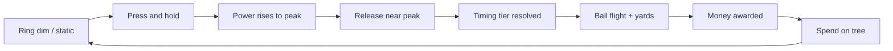

# Core Loop

## Overview

Every session is a tight loop: **prepare → hold to charge → release at peak → ball flies → earn money → buy upgrades → repeat.**

## Setting

- **Driving range**, down-the-line camera (golfer facing away from player, ball toward distant targets)
- Player starts with **crappy range balls** and a **close net**
- Progression extends flight distance and unlocks farther targets

## Input: one-hand hold-release swing

| Rule | Value |
|------|-------|
| Input per swing | **One gesture** — press/hold, then release (mouse left or spacebar) |
| Press/hold | Instant wind-up; outer ring shrinks toward inner sweet spot over ~0.5s |
| Release | Release when outer aligns with inner (±perfect window); holding past peak decays tier to OK then Miss |
| Idle | Ring dim/static; no charge until next hold |
| Charge indicator (v1) | **Side charge meter** (left, x≈60) — concentric rings with fixed gold inner sweet spot; outer ring shrinks inward to overlap at peak (~0.5s); green/gold pulse + "SWEET SPOT" in release band; vertical power bar with peak tick; red pulse if held too long; hidden when idle |
| Alternate indicators (later) | Arc meter, compression bar — same timing logic |

Release while idle is ignored. A new hold during cooldown is ignored. Swing cooldown applies after resolve, before the next charge is allowed.

### Timing tiers

| Tier | Window (baseline) | Payout multiplier |
|------|-------------------|-------------------|
| **Perfect** | Tightest (±50 ms from peak) | 1.0× (baseline for rhythm) |
| **Good** | Medium (±100 ms) | ~0.7× |
| **OK** | Wide (±150 ms) | ~0.4× |
| **Miss** | Outside all windows, or release before min hold (~50 ms) | Pity payout (~0.1×) |

**Fortune Mill chill rule:** Miss never pays zero. Partial credit keeps flow alive.

> **v1 note:** Combo / multi-strike chaining was removed for rework. Swings follow classic **IDLE → CHARGING → resolve → cooldown → IDLE**. Late-game skill curve TBD.

## Swing cadence (separate from charge duration)

After a swing resolves, a **cooldown** gates the next valid charge input.

| Concept | Description |
|---------|-------------|
| Charge duration | Time for power to reach peak (~0.5s, tuned in `balance.gd`) |
| Swing cadence | Minimum time between resolved swings |
| Upgrades | "Faster follow-through" shrinks cooldown → more balls per minute |

This lets throughput increase without making the timing minigame stressful.

## Ball flight resolution

1. Timing tier → base accuracy modifier
2. Player stats (club, ball, power upgrades) → **yards**
3. Target zone (v1.5+) → zone multiplier
4. All mults → final payout (see [03-economy.md](03-economy.md))

Ball flight is primarily **visual** — tween along arc toward target depth. Physics simulation is not required for v1.

## Feedback tiers (game feel)

Each resolved swing emits a `FeedbackTier` used by audio/VFX:

| FeedbackTier | Typical trigger |
|--------------|-----------------|
| `whisper` | OK hit, small payout |
| `warm` | Perfect |
| `jackpot` | Bullseye, crit, payout threshold |
| `milestone` | Branch unlock, time-of-day shift |

See [07-art-and-atmosphere.md](07-art-and-atmosphere.md) for spike rules.

## Passive income (v2 — stub in v1)

Not active in v1. Architecture reserves:

- `manualIncome` — player rhythm swings
- `passiveIncome` — golf friend auto-swings (see [06-characters.md](06-characters.md))

v1 economy module should not assume passive income exists, but types should allow `passiveRate: number` defaulting to 0.

## v1 core loop checklist

- [ ] Hold begins charge and power curve rises to peak
- [ ] Release registers timing against peak moment
- [ ] Tier + yards + payout calculated and emitted as event
- [ ] Swing cooldown enforced between swings
- [ ] Ball flight tween plays regardless of tier

## Related docs

- Economy math: [03-economy.md](03-economy.md)
- Range and targets: [02-world-and-range.md](02-world-and-range.md)
- Upgrades affecting rhythm: [04-upgrade-tree.md](04-upgrade-tree.md) → Branch 1
