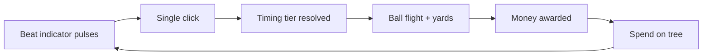

# Core Loop

## Overview

Every session is a tight loop: **prepare → click on beat → ball flies → earn money → buy upgrades → repeat.**

## Setting

- **Driving range**, down-the-line camera (golfer facing away from player, ball toward distant targets)
- Player starts with **crappy range balls** and a **close net**
- Progression extends flight distance and unlocks farther targets

## Input: one-hand rhythm

| Rule | Value |
|------|-------|
| Input per swing | **One click** (mouse button or spacebar) |
| BPM | Fixed **60–72**; does not increase with upgrades |
| Beat indicator (v1) | **Pulsing ring** at ball — click when rings align |
| Alternate indicators (later) | Bouncing marker, sweep line — same timing logic |

### Timing tiers

| Tier | Window (baseline) | Payout multiplier | Combo |
|------|-------------------|-------------------|-------|
| **Perfect** | Tightest | 1.0× (baseline for rhythm) | Advances combo |
| **Good** | Medium | ~0.7× | May advance combo (upgradeable) |
| **OK** | Wide | ~0.4× | No combo advance |
| **Miss** | Outside all windows | Pity payout (~0.1×) | Breaks combo |

**Fortune Mill chill rule:** Miss never pays zero. Partial credit keeps flow alive.

### Combo system

- Consecutive **Perfect** hits stack a combo counter
- Combo grants escalating multiplier (e.g. +10% per stack, cap tunable)
- **Miss** breaks combo; **Good** breaks unless "Combo keeper" upgrade owned
- Combo breakpoint (e.g. 5, 10 Perfects) can trigger **jackpot feedback tier** — see [07-art-and-atmosphere.md](07-art-and-atmosphere.md)

## Swing cadence (separate from BPM)

After a swing resolves, a **cooldown** gates the next valid beat input.

| Concept | Description |
|---------|-------------|
| BPM | How fast the beat indicator pulses (fixed, calm) |
| Swing cadence | Minimum time between resolved swings |
| Upgrades | "Faster follow-through" shrinks cooldown → more balls per minute |

This lets throughput increase without making the rhythm minigame stressful.

## Ball flight resolution

1. Timing tier → base accuracy modifier
2. Player stats (club, ball, power upgrades) → **yards**
3. Target zone (v1.5+) → zone multiplier
4. All mults → final payout (see [03-economy.md](03-economy.md))

Ball flight is primarily **visual** — tween along arc toward target depth. Physics simulation is not required for v1.

## Feedback tiers (game feel)

Each resolved swing emits a `FeedbackTier` used by audio/VFX:

| FeedbackTier | Typical trigger |
|--------------|-----------------|
| `whisper` | OK hit, small payout |
| `warm` | Perfect, modest combo |
| `jackpot` | Bullseye, crit, combo milestone, payout threshold |
| `milestone` | Branch unlock, time-of-day shift |

See [07-art-and-atmosphere.md](07-art-and-atmosphere.md) for spike rules.

## Passive income (v2 — stub in v1)

Not active in v1. Architecture reserves:

- `manualIncome` — player rhythm swings
- `passiveIncome` — golf friend auto-swings (see [06-characters.md](06-characters.md))

v1 economy module should not assume passive income exists, but types should allow `passiveRate: number` defaulting to 0.

## v1 core loop checklist

- [ ] Beat clock runs at fixed BPM
- [ ] Single click registers timing against current beat phase
- [ ] Tier + yards + payout calculated and emitted as event
- [ ] Combo updates on tier rules
- [ ] Swing cooldown enforced between swings
- [ ] Ball flight tween plays regardless of tier

## Related docs

- Economy math: [03-economy.md](03-economy.md)
- Range and targets: [02-world-and-range.md](02-world-and-range.md)
- Upgrades affecting rhythm: [04-upgrade-tree.md](04-upgrade-tree.md) → Branch 1
