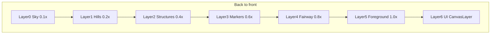

# World and Range

## Visual model: parallax 2.5D

Not flat single-plane 2D. Not full 3D. **Multiple 2D sprite layers** stacked with different scroll speeds, scale, and z-order to fake depth — ideal for a down-the-line driving range that recedes toward the horizon.

The player reads depth because:

- Far layers scroll slower than near layers
- Ball shrinks as it flies **up-screen** toward the horizon
- Yard markers and nets sit on mid-depth layers at smaller scale

## Camera

- **Down-the-line view**: player looks over the golfer's shoulder toward the range
- Golfer in lower third; ball at tee; fairway/targets recede toward horizon
- `Camera2D` fixed for v1; `offset` shake + brief zoom punch on jackpot only

## Parallax layer stack

Back to front — each layer is a Godot `Parallax2D` with `scroll_scale`:

| Layer | Content | scroll_scale | Depth cue |
|-------|---------|--------------|-----------|
| 0 | Sky, clouds | ~0.1 | Farthest |
| 1 | Distant hills, trees | ~0.2 | |
| 2 | Range structures, far netting | ~0.4 | |
| 3 | Yard markers, bullseyes (v1.5+) | ~0.6 | Smaller scale |
| 4 | Fairway ground | ~0.8 | |
| 5 | Golfer, tee, ball | 1.0 (foreground anchor) | Nearest |
| 6 | UI, screen particles | `CanvasLayer` | Screen-fixed |



### Godot scene structure

```
RangeView (Node2D)
├── Parallax2D_Sky
├── Parallax2D_Hills
├── Parallax2D_Structures
├── Parallax2D_Markers
├── Parallax2D_Fairway
├── Foreground (Node2D)
│   ├── Golfer
│   ├── Tee
│   └── Ball
└── BeatRing
```

See [../technical/01-architecture.md](../technical/01-architecture.md).

## Driving range layout

```
[ sky / clouds / hills — parallax layers 0–1 ]

        ◎ bullseye (far, v1.5+, layer 3)
      ——— 150yd marker
      ——— 100yd marker
      ——— 50yd marker
    [ net / target zone — layer 2–3 ]

         ·  ball flight path (up-screen, scale down)

    [ golfer + tee — layer 5 ]
```

## Ball flight illusion (2.5D)

On each swing resolve:

1. **Position tween**: ball moves from tee toward a horizon point (decreasing y, toward top of viewport)
2. **Scale tween**: `1.0` → `0.25–0.4` — reads as flying away from camera
3. **Duration**: scales with yards (~0.4–0.8s)
4. Reset ball to tee after tween completes

Parallax layers stay static during flight (world is stable; ball moves through it).

## Starting state (v1)

- Short range: close net on layer 2–3, **3+ parallax layers** with visible scroll speed differences
- Single effective target zone (mechanical; bullseye rings in v1.5)
- Crappy balls = short flight cap, high variance

## Progression visuals

| Upgrade / milestone | Visual change |
|---------------------|---------------|
| Extend range | Deeper layers unlock; markers farther up-screen; optional parallax scroll offset |
| Bigger net | Target zone sprite scales up on layer 3 |
| New bullseyes | Concentric rings at distance tiers on marker layer |
| Time-of-day shift | Palette tint per layer (sky vs grass independent) |

**Extend range** unlocks depth — not just bigger numbers.

## Target zones and bullseyes (v1.5+)

Bullseyes provide **zone multipliers** in the payout formula.

| Zone | Example multiplier | Skill demand |
|------|-------------------|--------------|
| Outer net | 1.0× | Forgiving |
| Middle ring | 2.0× | Good timing + distance |
| Center bullseye | 5.0×+ | Perfect timing + upgrades |

Center bullseye hits are primary **jackpot feedback** triggers.

## Time-of-day cycle

Progression-driven — not real-time clock. Unlocked via range upgrades / milestones.

| Phase | Mood | Example unlock |
|-------|------|----------------|
| **Soft morning** | Cool greens, light mist, birds | Game start |
| **Bright midday** | Clear sky, crisp shadows | First club upgrade or $ milestone |
| **Golden evening** | Amber light, long shadows | Distance / bullseye milestone |
| **Blue hour** | Range lamps glow, cozy netting lights | Late economy branch |

### Implementation notes

- Palette tables per phase in `scripts/config/atmosphere.gd` (v1.5)
- `modulate` or shader tint on each parallax layer; sky and grass tint independently
- Crossfade 2–3s on unlock; triggers `milestone` feedback tier

## Ambient motion (always on)

- Slow cloud drift on sky layer (sprite offset or `Parallax2D` auto-scroll)
- Grass tuft sway on fairway layer (2-frame or sine)
- Optional: bird on sky layer, flag flutter on structure layer
- Range lamp flicker during blue hour

Motion stays **subtle** — calm baseline, not distracting from rhythm ring.

## World does NOT change during jackpot spikes

Sky/grass parallax unchanged during jackpot. Frenzy in UI layer, particles, `Camera2D.offset` — see [07-art-and-atmosphere.md](07-art-and-atmosphere.md).

## v1 scope

- Down-the-line layout with placeholder `ColorRect` / `Sprite2D` per layer
- **Minimum 3 parallax layers** with distinct `scroll_scale`
- Ball flight: position + scale tween
- Single target zone (implicit); no bullseye rings yet
- Static morning palette

## v1.5 scope

- Bullseye rings with zone multiplier
- Time-of-day unlocks (at least 2 phases)
- Extend range scroll / deeper markers

## Related docs

- Art direction: [07-art-and-atmosphere.md](07-art-and-atmosphere.md)
- Godot architecture: [../technical/01-architecture.md](../technical/01-architecture.md)
- Range upgrades: [04-upgrade-tree.md](04-upgrade-tree.md) → Branch 5
- Payout zones: [03-economy.md](03-economy.md)
