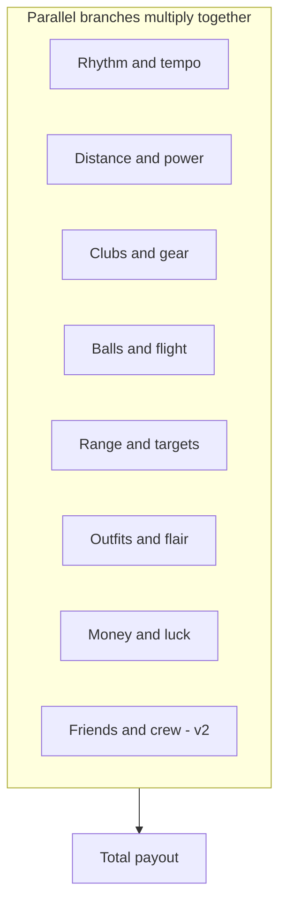

# Upgrade Tree

## Design goal

Player always sees **3–5 affordable next purchases** across **different branches**. Never a single linear line.



## v1 shipped branches

Full data model supports all branches; v1 **content** ships only:

1. **Rhythm** — window, cadence, combo
2. **Distance** — yards, balls, basic club tier
3. **Economy** — $/yard, global mult

Other branches exist in definitions as stubs or locked until milestones.

---

## Branch 1: Rhythm and tempo

| Upgrade ID (example) | Effect |
|----------------------|--------|
| `metronome` | Wider Perfect/Good timing window per level |
| `faster_followthrough` | Reduce swing cooldown per level |
| `combo_keeper` | Good hits no longer break combo (binary unlock) |
| `perfect_bonus` | +% payout on Perfect tier per level |
| `beat_visual` | Cosmetic beat indicator skins |

**Swing cadence** is separate from BPM — see [01-core-loop.md](01-core-loop.md).

---

## Branch 2: Distance and power

| Upgrade ID | Effect |
|------------|--------|
| `leg_day` | Base yard multiplier per level |
| `followthrough_form` | +% distance per level |
| `core_strength` | Raises max yard cap per level |
| `ball_speed_trail` | Visual + tiny distance bump |

---

## Branch 3: Clubs (tiered equipment)

| Slot | Progression example |
|------|---------------------|
| Driver | Rusty wood → Range rental → Starter set → Bent Pin Driver → … |
| Irons | Unlocks at yard milestone |
| Putter | Late-game bullseye specialist |

Each tier is a **named unlock** with display name and flavor text:

> "You equipped the **Bent Pin Driver**."

Mechanically: `clubMult` multiplier step per tier.

---

## Branch 4: Balls

| Upgrade ID | Effect |
|------------|--------|
| `ball_quality` | Range scrape → Recycled → Two-piece → Pro |
| `spin_control` | Reduces yard variance per level |
| `lucky_dip` | Crit / jackpot chance per level |

Starting balls: low max distance, high variance.

---

## Branch 5: Range and targets

| Upgrade ID | Effect |
|------------|--------|
| `extend_range` | Farther markers + background scroll |
| `bigger_net` | Larger target forgiveness zone |
| `bullseye_50` / `100` / `150` | New rings with zone mults |
| `jackpot_board` | Rare center hit burst payout |
| `time_of_day_*` | Unlock atmosphere phases |
| `night_range` | Cosmetic skin + small set bonus |

See [02-world-and-range.md](02-world-and-range.md).

---

## Branch 6: Outfits (stat pieces per slot)

Each slot has a **unique stat lane**. Bonuses stay small (~2–5% per tier) so clubs/bullseyes remain primary.

| Slot | Stat lane | Example items |
|------|-----------|---------------|
| Hat | Combo mult / combo decay | Bucket hat, Visor |
| Shirt | $/yard / global income | Polo, Sponsored jersey |
| Pants | Distance / power | Khakis, Loud pants |
| Shoes | Swing cadence | Sneakers, Spikes |
| Gloves | Timing window | Worn glove, Pro glove |
| Accessory | Crit / jackpot chance | Ball marker, Sunglasses |

Named unlock example:

> "**Bucket Hat** — Combo decays 10% slower."

Sprite layers in v1.5 — see [06-characters.md](06-characters.md).

---

## Branch 7: Economy and luck

| Upgrade ID | Effect |
|------------|--------|
| `dollars_per_yard` | Direct $/yard mult |
| `tip_jar` | Flat bonus per swing |
| `sponsorship` | Global % mult |
| `crit_chance` | Random high mult single swing |

---

## Branch 8: Friends and crew (v2)

| Upgrade ID | Effect |
|------------|--------|
| `hire_buddy` | Enables passive swings |
| `buddy_cadence` | Friend swings faster |
| `buddy_form` | Friend payout per swing |
| `caddy_crew` | Additional passive slots |

See [06-characters.md](06-characters.md).

---

## Upgrade definition schema

Each upgrade in `definitions.gd` (or `.tres` Resource):

```typescript
interface UpgradeDefinition {
  id: string;
  branch: UpgradeBranch;
  displayName: string;
  description: string;
  maxLevel: number;
  baseCost: number;
  growthRate: number;
  prerequisite?: { upgradeId: string; level: number };
  milestone?: { stat: string; value: number };
  effect: UpgradeEffect;
  namedUnlocks?: Record<number, string>; // level → display name
}
```

## Effect types

```typescript
type UpgradeEffect =
  | { type: 'multiply'; stat: keyof PlayerStats; valuePerLevel: number }
  | { type: 'add'; stat: keyof PlayerStats; valuePerLevel: number }
  | { type: 'unlock'; feature: string }
  | { type: 'binary'; stat: keyof PlayerStats; value: number };
```

## UI presentation

- Group by branch in scrollable side panel
- Each row: name, current level, next effect preview, cost, buy button
- Gray out locked upgrades with milestone hint: "Unlock at 500 total yards"
- Highlight affordable upgrades across branches (3–5 visible without scroll when possible)

## Related docs

- Economy formula: [03-economy.md](03-economy.md)
- Phase scope: [05-progression.md](05-progression.md)
- Data model: [../technical/02-data-model.md](../technical/02-data-model.md)
