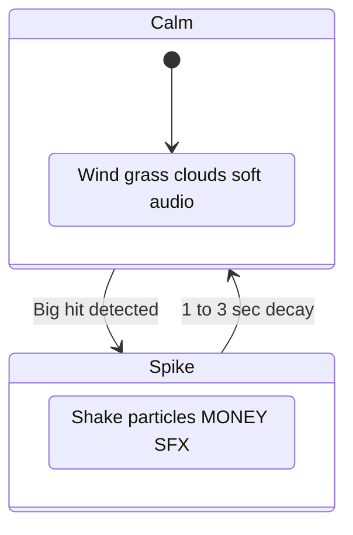

# Art and Atmosphere

## Aesthetic target

**Miyazaki-adjacent pixel art** on a cozy driving range — warm, pastoral, hand-crafted. Not a casino. Not horror. Fortune Mill's **mechanical dopamine** with Ghibli's **breathing world**.

Rendered as **parallax 2.5D**: layered 2D sprites that simulate depth toward the horizon.

## Core tension: calm default, jackpot spikes



90% of play is calm. Spikes are **earned** — contrast makes them hit hard.

---

## Pixel art rules

| Rule | Value |
|------|-------|
| Base sprite size | 32×32 character, 16×16 tiles |
| Parallax layers | Wide strips (2–3× viewport width) for scroll headroom |
| Colors per sprite | 4–8, warm shadows (not pure black) |
| Scaling | Integer only via Godot stretch `scale_mode=integer` |
| Texture filter | Nearest (no blur) |
| Palette | Avoid purple-heavy skies; warm ambers, meadow greens, soft blues |

### Hand-crafted feel

- Subtle color ramps in background layers (dither or extra ramp colors)
- Limited palette per time-of-day phase
- Small life: birds on sky layer, pollen motes, flag flutter on structure layer

### Placeholder art (v1)

- `ColorRect` or solid `Sprite2D` blocks per parallax layer
- Configure nearest filtering and integer scale from day one

---

## Time-of-day palettes

| Phase | Sky | Grass | Light | Accent |
|-------|-----|-------|-------|--------|
| Soft morning | Pale blue, mist | Cool green | Diffuse | Bird song |
| Bright midday | Clear blue | Vibrant green | Crisp white | Full visibility |
| Golden evening | Amber, peach | Warm green | Long shadows | Nostalgic |
| Blue hour | Deep blue | Dark green | Range lamps | Warm lamp pools |

Crossfade 2–3s per layer `modulate`. See [02-world-and-range.md](02-world-and-range.md).

---

## Parallax 2.5D art guidelines

| Layer | Art notes | Motion |
|-------|-----------|--------|
| Sky | Tall gradient or tiled clouds; widest strip | Slowest scroll ~0.1× |
| Hills | Silhouette treeline; medium width | ~0.2× |
| Structures | Net poles, shack, lamps | ~0.4× |
| Markers | Yard signs, bullseyes; scale down visually | ~0.6× |
| Fairway | Ground strip with grass tufts | ~0.8× |
| Foreground | Golfer, tee; full scale | Fixed anchor 1.0× |

**Light direction:** upper-left warm source across all layers for cohesion.

**Ball flight:** separate from parallax — tween on foreground layer; scale down for depth.

---

## Feedback tier system

### whisper (normal hits)

- Soft tick SFX
- Small `$` float (`Label` or `RichTextLabel` on CanvasLayer), fades quickly
- No camera shake

### warm (Perfect, modest combo)

- Satisfying woody **thwack** (`AudioStreamPlayer`)
- Medium `$` float
- Brief flash on ball (`modulate` pulse)
- Combo counter pulse in HUD

### jackpot (big moments)

Triggers when any of:

- Bullseye center hit
- Crit roll succeeds
- Combo breakpoint (e.g. 10 Perfects)
- Single swing payout ≥ `jackpot_threshold`

Effects (1–3 seconds, then decay):

- `Camera2D.offset` shake + brief zoom
- `GPUParticles2D` gold shower at ball
- Cascading `$` labels with `Tween` scale pop
- Layered SFX via multiple `AudioStreamPlayer` nodes
- Ambient music `volume_db` duck 20%, brief stinger
- **Parallax layers unchanged**

### milestone (unlocks)

- 3–5 second celebratory banner on CanvasLayer
- Time-of-day crossfade on parallax layers
- Returns to calm automatically

---

## Spike rules (non-negotiable)

1. Max spike duration **1–3 seconds** of peak intensity
2. Ambient track ducks then fades back
3. Frenzy in **CanvasLayer UI + particles + Camera2D** — not parallax palette swap
4. Never stack multiple full jackpot sequences; queue or truncate
5. Early game: jackpots rare; late game: bigger payouts trigger more often; baseline stays calm

---

## Audio direction

### Ambient loop (always)

- Wind, distant birds, soft pastoral bed
- Optional: light piano or acoustic guitar
- `AudioStreamPlayer` loop, low volume

### Swing SFX

| Tier | Sound |
|------|-------|
| Miss/OK | Muffled tap |
| Good | Clean thwack |
| Perfect | Crisp thwack + harmonic chime |
| Jackpot | Stacked layers on Perfect |

### Music

- Single ambient track for v1
- Jackpot: 2–3s stinger overlay
- No constant high-energy BGM

---

## UI visual style

- Side panel: `PanelContainer` warm wood/cream theme
- Upgrade rows: `HBoxContainer` with buy `Button`
- Currency: large `Label`, K/M/B formatting
- Number popups: gold `modulate` on jackpot
- No purple UI chrome

### RPG UI kit (Craftpix #255216)

Source sprites live in `assets/imported/rpg_ui_kit/PNG/` (parchment panels, teal accents, 9-slice buttons). Use **Nearest** texture filter (project default) and integer scale — same rules as parallax pixel art. Prefer parchment/teal kit tones over purple UI chrome when reskinning HUD and upgrade panels (Pass 1+).

---

## Asset pipeline

1. AI or rough sketch → Aseprite
2. Clean to 4–8 color palette per sprite
3. **Parallax strips:** export wide PNG per layer (e.g. 960×128 for 480 viewport)
4. Character: sprite sheet → Godot `SpriteFrames` or AtlasTexture
5. Import: disable filter on all pixel assets (or project-wide Nearest)

---

## Godot project settings reference

```ini
[display]
window/size/viewport_width=270
window/size/viewport_height=480
window/size/window_width_override=540
window/size/window_height_override=960
window/handheld/orientation=1
window/stretch/mode="canvas_items"
window/stretch/scale_mode="integer"

[rendering]
textures/canvas_textures/default_texture_filter=0
```

Per-texture: set `texture_filter = Nearest` on import or Sprite2D.

### Parallax2D example

```gdscript
# On each Parallax2D node in editor or script:
scroll_scale = Vector2(0.1, 0.1)  # sky — adjust per layer
```

### Ball depth tween example

```gdscript
var tween := create_tween().set_parallel(true)
tween.tween_property(ball, "position", horizon_pos, flight_time)
tween.tween_property(ball, "scale", Vector2(0.3, 0.3), flight_time)
```

---

## Related docs

- Parallax layer stack: [02-world-and-range.md](02-world-and-range.md)
- Godot stack: [../technical/00-stack.md](../technical/00-stack.md)
- Core feedback triggers: [01-core-loop.md](01-core-loop.md)
- Economy thresholds: [03-economy.md](03-economy.md)
