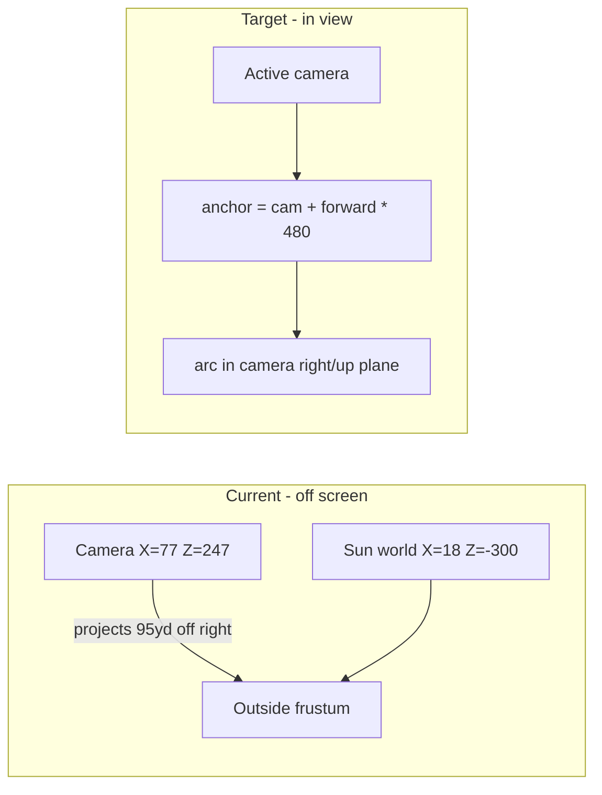

# Fix Sun/Moon Visibility — Implementation Plan

> **For agentic workers:** Implement task-by-task. Steps use checkbox (`- [ ]`) syntax.

**Goal:** Make sun and moon visible in the player viewport by positioning them along the **active camera's look direction**, not at fixed world `(X, Y, Z=-300)` coordinates.

**Root cause:** The ortho harvest camera sits at `(77, 71, 247)` with `size ≈ 13.3` (half-width ~24yd). Midday sun is placed at world `(~18, 55, -300)`. Projected onto the camera's right axis, that point is **~95yd off-center** — entirely outside the ~24yd half-frustum. Moon has the same problem. This is not primarily a Z/skybox issue; the sprites are simply off-screen.

**Architecture:** Replace `celestial_world_position(cycle_time, is_moon)` with a camera-aware helper that anchors celestials on the camera forward ray at `CELESTIAL_VIEW_DISTANCE` (inside the 500-radius sky dome), then offsets along camera **right** (azimuth) and camera **up** (elevation). `RangeSkyDome` passes `_follow_camera` each update. Sprites get a small `render_priority` bump so they draw after the sky shell.

**Tech stack:** Godot 4.7, GDScript, `DayNightPalette`, `RangeSkyDome`, `verify_day_night.gd`.

---

## Diagnosis (geometry)



| Factor | Value | Impact |
|--------|-------|--------|
| Camera position | `(77, 71, 247)` | Offset from world origin |
| Ortho half-width | ~24yd | Tiny frustum |
| Sun world X | `cos(angle)*35` ≈ 0–35 | Ignores camera X=77 |
| Projected offset | ~95yd on camera right | **Off-screen** |
| Sky dome radius | 500 | Secondary: sprites at ~547yd were outside shell |

---

## Target positioning model

```gdscript
# day_night_palette.gd — new signature
static func celestial_world_position(
    cycle_time: float,
    is_moon: bool,
    camera: Camera3D
) -> Vector3:
    var angle := celestial_angle(cycle_time, is_moon)
    var elevation := sin(angle)
    var along := cos(angle)
    var forward := -camera.global_transform.basis.z.normalized()
    var right := camera.global_transform.basis.x.normalized()
    var cam_up := camera.global_transform.basis.y.normalized()
    var anchor := camera.global_position + forward * CELESTIAL_VIEW_DISTANCE
    return (
        anchor
        + right * (along * CELESTIAL_ARC_HALF_WIDTH)
        + cam_up * lerpf(CELESTIAL_HORIZON_OFFSET, CELESTIAL_ZENITH_OFFSET, elevation)
    )
```

| Constant | Proposed | Notes |
|----------|----------|-------|
| `CELESTIAL_VIEW_DISTANCE` | `480.0` | Inside `DOME_RADIUS` (500); along look ray |
| `CELESTIAL_ARC_HALF_WIDTH` | `6.0` | Horizontal arc in view (tune; was 35 world-X) |
| `CELESTIAL_HORIZON_OFFSET` | `-4.0` | Slightly below center at rise/set (on skyline) |
| `CELESTIAL_ZENITH_OFFSET` | `8.0` | High in frame at noon |

Remove or repurpose unused world constants: `CELESTIAL_HORIZON_Z`, `CELESTIAL_HORIZON_Y`, `CELESTIAL_ZENITH_Y`, `CELESTIAL_HORIZON_HALF_WIDTH`.

When the camera pans, celestials stay in the sky region the player is looking at (intentional).

---

## Render hardening (secondary)

In [`range_sky_dome.gd`](scripts/visual/range_sky_dome.gd) `_make_celestial_sprite`:

- `sprite.render_priority = 8` (sky dome mesh uses `-128`)
- Keep `top_level = true`, `billboard = enabled`, `shaded = false`
- Optional: if still faint, bump `SUN_PIXEL_SIZE` to `0.35`

Sky shader already uses `depth_draw_never` — no change needed there.

---

## Files to change

| File | Change |
|------|--------|
| [`scripts/config/day_night_palette.gd`](scripts/config/day_night_palette.gd) | Camera-aware `celestial_world_position`; new view-space constants |
| [`scripts/visual/range_sky_dome.gd`](scripts/visual/range_sky_dome.gd) | Pass `_follow_camera` to palette; `render_priority`; guard when camera null |
| [`tools/verify_day_night.gd`](tools/verify_day_night.gd) | Frustum test: projected offset on camera right/up within ortho bounds |
| [`docs/design/02-world-and-range.md`](docs/design/02-world-and-range.md) | Update bullet: celestials anchored on camera forward ray |

---

## Tasks

### Task 1: Camera-relative position helper

**File:** `scripts/config/day_night_palette.gd`

- [ ] Replace world-Z constants with `CELESTIAL_VIEW_DISTANCE`, `CELESTIAL_ARC_HALF_WIDTH`, `CELESTIAL_HORIZON_OFFSET`, `CELESTIAL_ZENITH_OFFSET`
- [ ] Change `celestial_world_position(cycle_time, is_moon, camera: Camera3D) -> Vector3`
- [ ] Add `celestial_view_offset(cycle_time, is_moon, camera) -> Vector2` returning `(right_dot, up_dot)` for tests

### Task 2: Wire camera into sky dome

**File:** `scripts/visual/range_sky_dome.gd`

- [ ] Pass `_follow_camera` into `celestial_world_position` in `_update_celestial`
- [ ] Skip update if `_follow_camera == null`
- [ ] Set `render_priority = 8` on celestial sprites
- [ ] Remove dead `_sun_world_position` if unused, or keep for debug

### Task 3: Frustum verification

**File:** `tools/verify_day_night.gd`

- [ ] Replace world-Z placement checks with camera frustum checks:
  - Load `range_view.tscn`, get `Camera3D`
  - At t=50, t=84, t=0 (moon): `abs(right_dot) < camera.size * aspect * 0.6` and `up_dot` within `camera.size * 0.6`
- [ ] Keep dusk alpha and timing checks unchanged

### Task 4: Verify + tune

- [ ] `$GODOT --headless --path . --quit-after 2`
- [ ] `$GODOT --headless --script res://tools/verify_day_night.gd`
- [ ] In editor at t=50: sun centered over down-range skyline; adjust `CELESTIAL_ARC_HALF_WIDTH` / offsets if needed

### Task 5: Doc tweak

- [ ] Update implementation note in `02-world-and-range.md`

---

## Expected result

- **Day (t≈50):** Yellow sun disc visible in upper-center sky, over the far fairway
- **Dusk (t≈84):** Low warm sun on the skyline
- **Night (t≈0):** Moon visible in same sky region
- **Camera pan:** Sun/moon stay in the viewed sky (move with camera forward anchor)

---

## Out of scope

- World-locked celestials when camera pans away (would need separate horizon rig)
- DirectionalLight rotation sync
- Sun glow/halo shader
