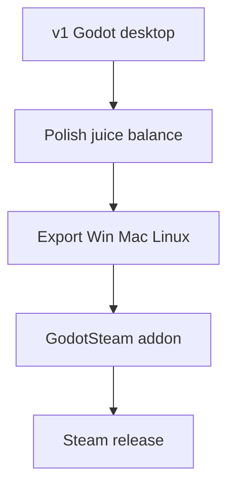

# Tech Stack

## v1 stack

| Layer | Choice | Version notes |
|-------|--------|---------------|
| Engine | **Godot 4.x** | 2D, parallax, tweens, particles, audio |
| Language | **GDScript** | Typed where possible; `class_name` for shared types |
| Editor workflow | Godot Editor → **F5** | No npm/vite |
| State | Autoload singletons + plain classes | `GameState`, `EventBus` |
| Persistence | `user://save.json` | `FileAccess` + JSON |
| UI | **Control** nodes | `VBoxContainer`, `ScrollContainer` for upgrades |

## Why Godot 4

This project is:

- **Parallax 2.5D** — layered 2D sprites faking depth; `Parallax2D` is first-class
- **Pixel art** — nearest-neighbor filtering, integer scale
- **Incremental UI-heavy** — Control nodes + signals scale well
- **Steam north star** — native export without Tauri/Electron wrapper

Phaser + TypeScript was the original path for web-dev familiarity. Godot is the better fit for parallax atmosphere and desktop/Steam shipping.

## Pixel art project settings

In `project.godot`:

```ini
[application]
config/name="Golf Incremental"

[display]
window/size/viewport_width=480
window/size/viewport_height=270
window/size/window_width_override=960
window/size/window_height_override=540
window/stretch/mode="canvas_items"
window/stretch/scale_mode="integer"

[rendering]
textures/canvas_textures/default_texture_filter=0
```

`default_texture_filter=0` is **Nearest** (crisp pixels).

## Parallax 2.5D

Not flat canvas 2D. Multiple sprite layers at different `scroll_scale` values simulate depth on a down-the-line driving range. See [../design/02-world-and-range.md](../design/02-world-and-range.md).

Godot nodes: `Parallax2D` children under `RangeView` scene; foreground golfer/ball on a fixed `Node2D`.

## Project layout

```
golf_incremental/
├── project.godot
├── scenes/
├── scripts/
├── assets/
├── resources/
└── docs/
```

Full tree: [01-architecture.md](01-architecture.md).

## Desktop and Steam path

| Layer | Choice |
|-------|--------|
| Desktop export | Godot native (Windows, macOS, Linux) |
| Steam SDK | **GodotSteam** addon (v2+) |
| Distribution | SteamCMD, itch.io desktop builds |

### Release pipeline



No Tauri or Electron wrapper required.

### Steam requirements (future)

- $100 Steam Direct fee
- Store page assets
- Export presets in `export_presets.cfg`
- Optional: achievements, cloud saves via GodotSteam

## Web deployment (optional, not primary)

- Godot HTML5 export works for itch.io demos
- Bundle size ~15–30MB+ before assets — heavier than Phaser
- **Desktop-first** for v1 development and playtesting

## Art tools

- **Aseprite** — pixel editing, wide parallax layer exports
- Export PNG strips for `Parallax2D` children (layers should be wider than viewport for scroll)
- Character sprites: 32×32; tiles: 16×16

## Alternatives considered

| Stack | Pros | Cons |
|-------|------|------|
| Godot 4 + GDScript | Parallax, native Steam, editor | GDScript learning curve |
| Phaser + TS + Vite | Web skills, fast web deploy | Parallax manual; Steam needs wrapper |
| Godot + C# | Static typing | More setup than GDScript for 2D |

**Decision:** Godot 4 + GDScript.

## Related docs

- Architecture: [01-architecture.md](01-architecture.md)
- Agent splits: [03-agent-workstreams.md](03-agent-workstreams.md)
- Parallax world: [../design/02-world-and-range.md](../design/02-world-and-range.md)
