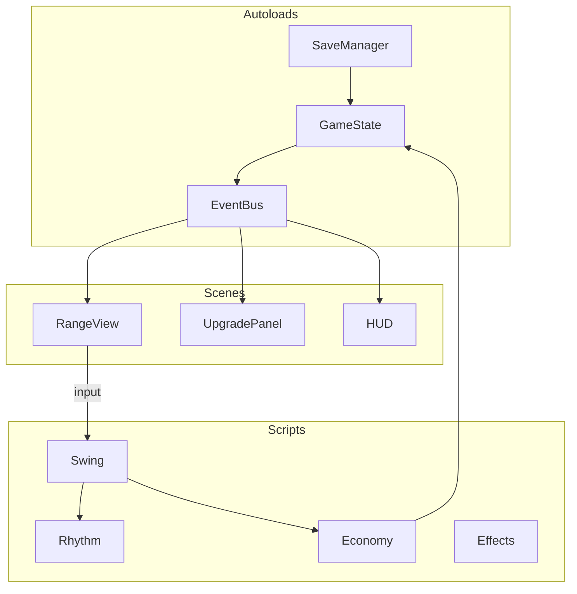
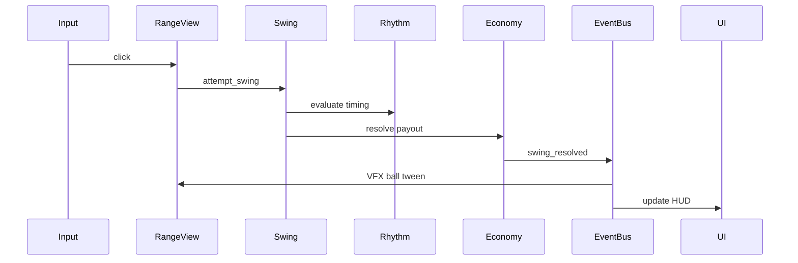

# Architecture

## Principles

1. **Logic ≠ view** — `economy.gd`, `rhythm.gd` have no scene-tree dependencies; scenes render and forward input
2. **Data-driven upgrades** — definitions in `scripts/game/upgrades/`, not hardcoded in scenes
3. **Signals over coupling** — Godot signals via `EventBus` autoload; views subscribe, logic emits
4. **Config centralization** — tune numbers in `scripts/config/balance.gd`
5. **Range scene owned by one scene** — `scenes/range/range_view.tscn`; other agents don't edit the 3D scene tree
6. **Real 3D, not faked depth** — world unit = 1 yard, tee at origin, `-Z` down the fairway; `Camera3D` projection replaces hand-rolled vanishing-point math. Pixel art is preserved via `AnimatedSprite3D`/`Sprite3D` billboards.

## Directory structure

```
golf_incremental/
├── docs/
├── project.godot
├── scenes/
│   ├── main.tscn                  # entry: range (Node3D) + UI
│   └── ui/
│       ├── hud.tscn
│       └── upgrade_panel.tscn
├── scripts/
│   ├── autoload/
│   │   ├── game_state.gd          # currency, stats, upgrade levels
│   │   ├── event_bus.gd           # global signals
│   │   └── save_manager.gd
│   ├── game/
│   │   ├── rhythm.gd
│   │   ├── swing.gd
│   │   ├── economy.gd
│   │   ├── passive.gd             # v2 stub
│   │   └── upgrades/
│   │       ├── definitions.gd
│   │       ├── effects.gd
│   │       └── categories.gd
│   ├── config/
│   │   └── balance.gd
│   ├── visual/
│   │   ├── fairway_ground_3d.gd   # striped ground ArrayMesh builder
│   │   └── forest_fence.gd        # textured fence quad builder
│   └── range/
│       ├── range_view.gd          # beat ring, ball flight, input
│       ├── ball_flight_3d.gd      # real projectile-motion trajectory
│       └── pickup_controller.gd   # camera-projected litter click pickup
├── resources/
│   └── upgrades/                  # optional .tres Resource files
├── assets/
│   ├── sprites/
│   └── audio/
└── addons/
    └── godotsteam/                # later
```

## Range scene tree (`scenes/range/range_view.tscn`)

```
RangeView (Node3D) — script: range_view.gd
├── WorldEnvironment          — flat background color, ambient light, fog
├── Sun (DirectionalLight3D)  — day/night angle, color, energy
├── Camera3D                  — fixed, over-shoulder, tilted down
├── Ground (MeshInstance3D)   — striped fairway ArrayMesh (FairwayGround3D)
├── ForestFence (Node3D)      — two tall textured quads (ForestFence)
├── Foreground (Node3D)
│   ├── LitteredBalls (Node3D) — Sprite3D children at real landing positions
│   ├── Golfer (AnimatedSprite3D, billboard)
│   └── Ball (AnimatedSprite3D, billboard)
├── ChargeMeter (Node2D)       — screen-space UI, unaffected by the 3D move
├── FxLayer (Node2D)           — screen-space hit-poof / cash-text / twinkle FX
└── JackpotFeedback (CanvasLayer) — already screen-space, unaffected
```

`Camera3D` lives on `RangeView`. Fixed for v1; brief `h_offset`/`v_offset` shake on jackpot (Camera3D's frustum-offset properties are the 3D analog of `Camera2D.offset`).

Screen-space 2D overlays (`ChargeMeter`, `FxLayer`) work as direct children of the `Node3D` root because `CanvasItem` nodes always render through the viewport's 2D canvas regardless of their ancestors' node type — no `CanvasLayer` wrapper is required unless you want a distinct draw layer.

## Module dependency graph



**Rule:** `scripts/game/*` never references scene nodes directly.

## Autoloads (project.godot)

| Name | Script | Role |
|------|--------|------|
| `EventBus` | `event_bus.gd` | Global signals |
| `GameState` | `game_state.gd` | Currency, upgrade levels, computed stats |
| `SaveManager` | `save_manager.gd` | Load/save/autosave |

Register in **Project → Project Settings → Autoload**.

## Scene responsibilities

### main.tscn

- Instantiates `range_view.tscn` (Node3D) and UI scenes
- `Camera3D` lives on RangeView, not main

### range_view.tscn + range_view.gd

- 3D ground/fence meshes, golfer, ball, litter billboards, beat ring
- `_input` or `_unhandled_input` → forward click to `Swing.attempt_swing()`
- Subscribe to `EventBus.swing_resolved` → real projectile-motion ball flight (`BallFlight3D`), particles, feedback tier
- Day/night driven by `DirectionalLight3D` + `WorldEnvironment`, not per-layer tint

### hud.tscn

- Currency, combo counter, milestone hint
- Subscribe to `EventBus.stats_changed`, `EventBus.swing_resolved`

### upgrade_panel.tscn

- Scrollable upgrade list by branch
- Subscribe to `EventBus.stats_changed`; call `GameState.purchase_upgrade(id)`

## Game loop flow



## Tick / update

- `rhythm.update(delta)` — advance beat phase
- `passive.update(delta)` — v2 only
- `range_view._process(delta)` calls rhythm update; or rhythm on autoload

Use `delta` in seconds (Godot convention). Game logic accepts `float` delta for testability.

## Ball flight (real projectile motion)

On `swing_resolved`, `BallFlight3D.build_path()` solves a real trajectory and `range_view.gd` samples it every frame:

1. `position(t) = origin + velocity0·t + Vector3(0, -0.5·g·t², 0)` — real `Vector3` world position, no manual scale tween needed (Camera3D projection scales it automatically)
2. Apex height derived from visual distance × per-contact-flavor ratio (`Balance.FLIGHT_APEX_RATIO`)
3. Flight duration clamped to `Balance.FLIGHT_TIME_MIN_SEC`/`FLIGHT_TIME_MAX_SEC` for arcade pacing
4. Reset ball to tee after flight completes; ball becomes a `Sprite3D` litter instance at the landing `Vector3`

Ground/fence geometry does not move during flight (extend_range grows world-space length, not scroll offset).

## Autosave

- `SaveManager` connects to `EventBus.upgrade_purchased`, throttled `swing_resolved`
- Timer every 30s in `_process` or `SceneTree` timer
- `_notification(NOTIFICATION_WM_CLOSE_REQUEST)` flush save

Save path: `user://save.json`

## Testing strategy (v1 light)

- `economy.gd`, `rhythm.gd`, `effects.gd` — test via Godot unit tests (`GdUnit4` optional) or manual `print` validation
- Integration: manual playtest per [v1-acceptance.md](../specs/v1-acceptance.md)

## Related docs

- Types and signals: [02-data-model.md](02-data-model.md)
- Parallel work: [03-agent-workstreams.md](03-agent-workstreams.md)
- World/range design: [../design/02-world-and-range.md](../design/02-world-and-range.md)
