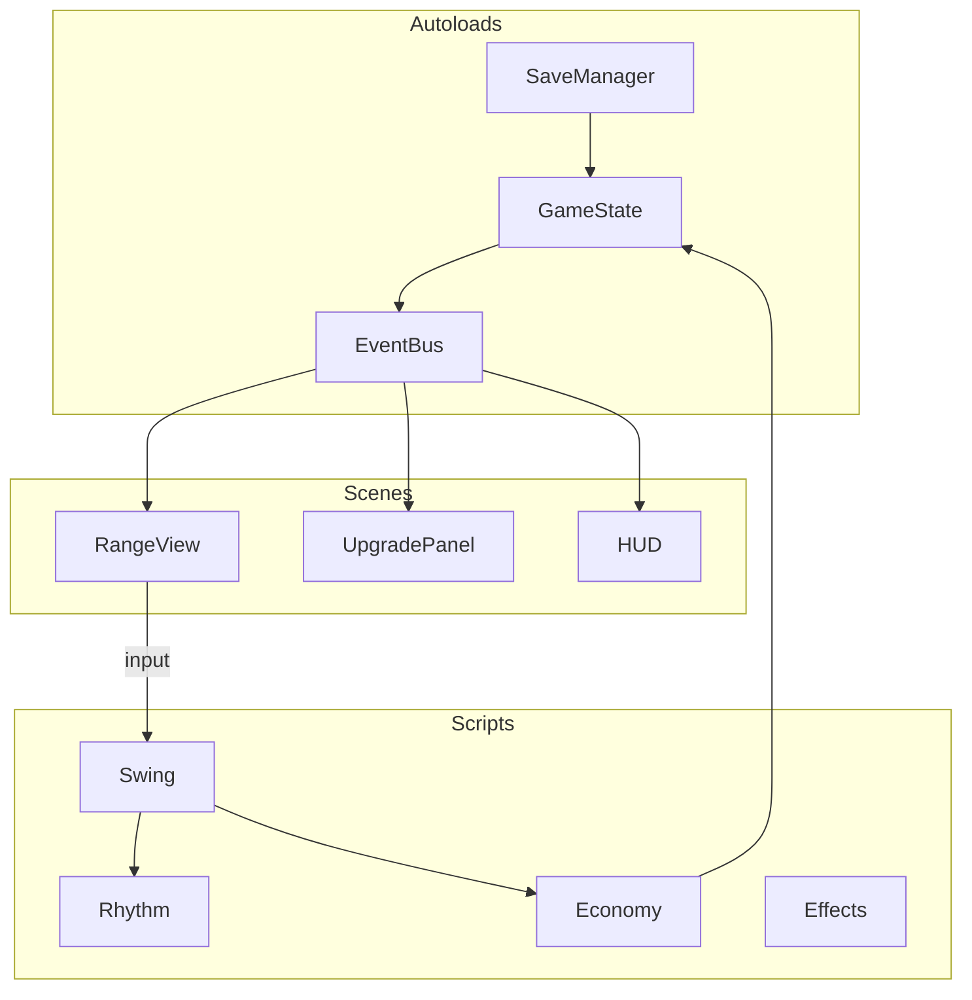
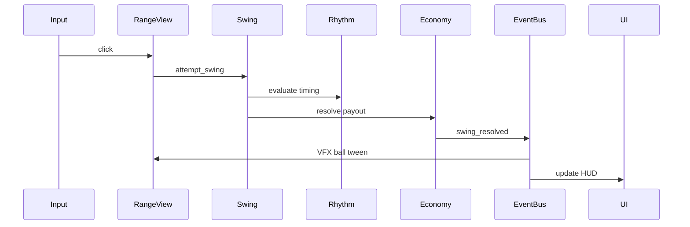

# Architecture

## Principles

1. **Logic ≠ view** — `economy.gd`, `rhythm.gd` have no scene-tree dependencies; scenes render and forward input
2. **Data-driven upgrades** — definitions in `scripts/game/upgrades/`, not hardcoded in scenes
3. **Signals over coupling** — Godot signals via `EventBus` autoload; views subscribe, logic emits
4. **Config centralization** — tune numbers in `scripts/config/balance.gd`
5. **Parallax owned by one scene** — `scenes/range/range_view.tscn`; other agents don't edit layer tree

## Directory structure

```
golf_incremental/
├── docs/
├── project.godot
├── scenes/
│   ├── main.tscn                  # entry: range + UI
│   ├── range/
│   │   ├── range_view.tscn        # Parallax2D layers + foreground
│   │   └── ball.tscn
│   └── ui/
│       ├── hud.tscn
│       └── upgrade_panel.tscn
├── scripts/
│   ├── autoload/
│   │   ├── game_state.gd          # currency, stats, upgrade levels
│   │   ├── event_bus.gd           # global signals
│   │   └── save_manager.gd
│   ├── game/
│   │   ├── rhythm.gd
│   │   ├── swing.gd
│   │   ├── economy.gd
│   │   ├── passive.gd             # v2 stub
│   │   └── upgrades/
│   │       ├── definitions.gd
│   │       ├── effects.gd
│   │       └── categories.gd
│   ├── config/
│   │   └── balance.gd
│   └── range/
│       └── range_view.gd          # beat ring, ball tween, input
├── resources/
│   └── upgrades/                  # optional .tres Resource files
├── assets/
│   ├── sprites/
│   ├── parallax/
│   └── audio/
└── addons/
    └── godotsteam/                # later
```

## Parallax scene tree (range_view.tscn)

```
RangeView (Node2D) — script: range_view.gd
├── Parallax2D_Sky          scroll_scale ≈ 0.1
│   └── Sprite2D / ColorRect
├── Parallax2D_Hills          scroll_scale ≈ 0.2
├── Parallax2D_Structures     scroll_scale ≈ 0.4
├── Parallax2D_Markers        scroll_scale ≈ 0.6
├── Parallax2D_Fairway        scroll_scale ≈ 0.8
├── Foreground (Node2D)       scroll_scale 1.0 — anchor
│   ├── Golfer (Sprite2D)
│   ├── Tee (Sprite2D)
│   └── Ball (Node2D) — or instance ball.tscn
└── BeatRing (Node2D)
```

`Camera2D` on `main.tscn` or `RangeView`. Fixed for v1; `offset` shake on jackpot.

## Module dependency graph



**Rule:** `scripts/game/*` never references scene nodes directly.

## Autoloads (project.godot)

| Name | Script | Role |
|------|--------|------|
| `EventBus` | `event_bus.gd` | Global signals |
| `GameState` | `game_state.gd` | Currency, upgrade levels, computed stats |
| `SaveManager` | `save_manager.gd` | Load/save/autosave |

Register in **Project → Project Settings → Autoload**.

## Scene responsibilities

### main.tscn

- Instantiates `range_view.tscn` and UI scenes
- `Camera2D` child if not on RangeView

### range_view.tscn + range_view.gd

- Parallax layers, golfer, ball, beat ring
- `_input` or `_unhandled_input` → forward click to `Swing.attempt_swing()`
- Subscribe to `EventBus.swing_resolved` → ball flight tween (up-screen + scale down), particles, feedback tier
- Optional: subtle `Parallax2D` scroll on beat for alive-world feel

### hud.tscn

- Currency, combo counter, milestone hint
- Subscribe to `EventBus.stats_changed`, `EventBus.swing_resolved`

### upgrade_panel.tscn

- Scrollable upgrade list by branch
- Subscribe to `EventBus.stats_changed`; call `GameState.purchase_upgrade(id)`

## Game loop flow



## Tick / update

- `rhythm.update(delta)` — advance beat phase
- `passive.update(delta)` — v2 only
- `range_view._process(delta)` calls rhythm update; or rhythm on autoload

Use `delta` in seconds (Godot convention). Game logic accepts `float` delta for testability.

## Ball flight (2.5D illusion)

On `swing_resolved`, tween ball:

1. Position: tee → horizon point (decreasing y toward top of screen)
2. Scale: `1.0` → `0.3` (receding into distance)
3. Duration: ~0.4–0.8s based on yards
4. Reset ball to tee after tween

Parallax layers do not move during flight (optional slight fairway scroll on extend_range).

## Autosave

- `SaveManager` connects to `EventBus.upgrade_purchased`, throttled `swing_resolved`
- Timer every 30s in `_process` or `SceneTree` timer
- `_notification(NOTIFICATION_WM_CLOSE_REQUEST)` flush save

Save path: `user://save.json`

## Testing strategy (v1 light)

- `economy.gd`, `rhythm.gd`, `effects.gd` — test via Godot unit tests (`GdUnit4` optional) or manual `print` validation
- Integration: manual playtest per [v1-acceptance.md](../specs/v1-acceptance.md)

## Related docs

- Types and signals: [02-data-model.md](02-data-model.md)
- Parallel work: [03-agent-workstreams.md](03-agent-workstreams.md)
- Parallax design: [../design/02-world-and-range.md](../design/02-world-and-range.md)
