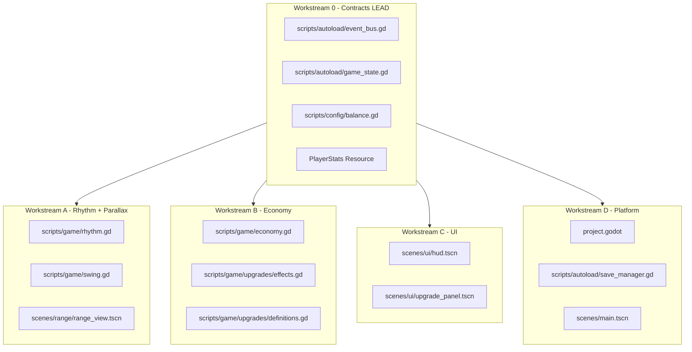

# Agent Workstreams

Parallel development guide for v1 on **Godot 4 + GDScript**. **Contract-first:** land autoloads, `PlayerStats`, and `EventBus` signals before splitting agents.

## Workstream diagram

## Workstream 0 — Contracts (lead agent, first)

**Owns:**

- `scripts/autoload/event_bus.gd` — all signals
- `scripts/autoload/game_state.gd` — currency, upgrade levels, stats cache stub
- `scripts/config/balance.gd` — constants, `DEFAULT_STATS`
- `scripts/game/player_stats.gd` or `resources/player_stats.gd` — `class_name PlayerStats`

**Reads:** [02-data-model.md](02-data-model.md), [../design/03-economy.md](../design/03-economy.md)

**Deliverable:** Project boots; autoloads registered; types compile.

**Gate:** Other workstreams start only after Workstream 0 merges.

---

## Workstream A — Rhythm + Parallax

**Owns:**

- `scripts/game/rhythm.gd` — beat clock, timing tier, combo
- `scripts/game/swing.gd` — cadence gate, orchestrate swing, emit signals
- `scenes/range/range_view.tscn` + `scripts/range/range_view.gd` — parallax layers, beat ring, ball tween, input
- `scenes/range/ball.tscn` (optional)

**Reads:**

- [../design/01-core-loop.md](../design/01-core-loop.md)
- [../design/02-world-and-range.md](../design/02-world-and-range.md)
- [02-data-model.md](02-data-model.md)

**Must NOT edit:**

- `definitions.gd`, `effects.gd`, `save_manager.gd`

**Emits:**

- `EventBus.swing_resolved`
- `EventBus.combo_broken`

**Acceptance:**

- Fixed BPM beat runs continuously
- Click near beat peak → Perfect; far → Miss with pity payout
- Swing cooldown enforced
- Ball tween: up-screen + scale-down (2.5D depth)
- At least 3 `Parallax2D` layers with distinct `scroll_scale`

---

## Workstream B — Economy

**Owns:**

- `scripts/game/economy.gd` — currency, purchase, payout, milestones
- `scripts/game/upgrades/definitions.gd` — v1 branches: rhythm, distance, economy
- `scripts/game/upgrades/effects.gd`
- `scripts/game/upgrades/categories.gd`
- `scripts/game/passive.gd` — stub (zero passive rate)

**Reads:**

- [../design/03-economy.md](../design/03-economy.md)
- [../design/04-upgrade-tree.md](../design/04-upgrade-tree.md)
- [02-data-model.md](02-data-model.md)

**Must NOT edit:**

- `range_view.tscn`, `rhythm.gd` timing window constants (consume stats only)

**Emits:**

- `EventBus.upgrade_purchased`
- `EventBus.stats_changed`
- `EventBus.milestone_reached`

**Acceptance:**

- Purchase deducts currency, increments level, recomputes stats
- Exponential costs match formula
- Multiplicative payout matches design doc

---

## Workstream C — UI

**Owns:**

- `scenes/ui/hud.tscn` + script
- `scenes/ui/upgrade_panel.tscn` + script
- Currency formatter utility

**Reads:**

- [../design/04-upgrade-tree.md](../design/04-upgrade-tree.md)
- [../design/07-art-and-atmosphere.md](../design/07-art-and-atmosphere.md)

**Must NOT edit:**

- `swing.gd`, `definitions.gd`, `range_view.tscn` parallax tree

**Subscribes to:**

- `EventBus.stats_changed`, `upgrade_purchased`, `swing_resolved`, `milestone_reached`

**Acceptance:**

- All v1 upgrades visible and purchasable when affordable
- Locked upgrades show milestone hint
- Currency updates on swing and purchase

---

## Workstream D — Platform

**Owns:**

- `project.godot` — pixel settings, autoload registration, main scene
- `scenes/main.tscn`
- `scripts/autoload/save_manager.gd`

**Reads:**

- [00-stack.md](00-stack.md)
- [01-architecture.md](01-architecture.md)

**Must NOT edit:**

- Game feel tuning in range_view (except main scene wiring)

**Subscribes to:**

- `upgrade_purchased`, throttled `swing_resolved` for save

**Acceptance:**

- F5 runs main scene in Godot 4
- Save to `user://save.json` persists across restart
- Autosave every 30s

---

## Integration order

1. **W0** autoloads + PlayerStats + EventBus
2. **W4** project.godot + empty main.tscn
3. **W4/W1** range_view parallax stub (3 layers)
4. **W2** economy with mock stats
5. **W1** rhythm + swing + ball tween
6. **W3** UI wired to signals
7. **W4** save wired to GameState
8. **Lead** juice + balance tuning

## Conflict avoidance rules

| Rule | Detail |
|------|--------|
| Single owner per file | No two agents edit same `.gd` / `.tscn` in parallel |
| Signals only cross boundaries | Scenes don't call economy internals directly |
| Parallax tree frozen to W1 | Other workstreams don't add Parallax2D children |
| Balance in one file | `balance.gd` — coordinate through lead |
| Scene merges | `.tscn` conflicts: lead integrates; prefer small scene instances |
| No plan file edits | Design changes go to `docs/` |

## Future workstreams (v1.5+)

| Workstream | Scope |
|------------|-------|
| **E: Atmosphere** | Time-of-day tints, ambient particles, cloud animation |
| **F: Targets** | Bullseye sprites on marker parallax layer |
| **G: Outfits** | Layered golfer sprites, outfit shop UI |
| **H: Friend** | passive.gd, friend sprite, offline earnings |

## Related docs

- v1 checklist: [../specs/v1-acceptance.md](../specs/v1-acceptance.md)
- Doc index: [../README.md](../README.md)
