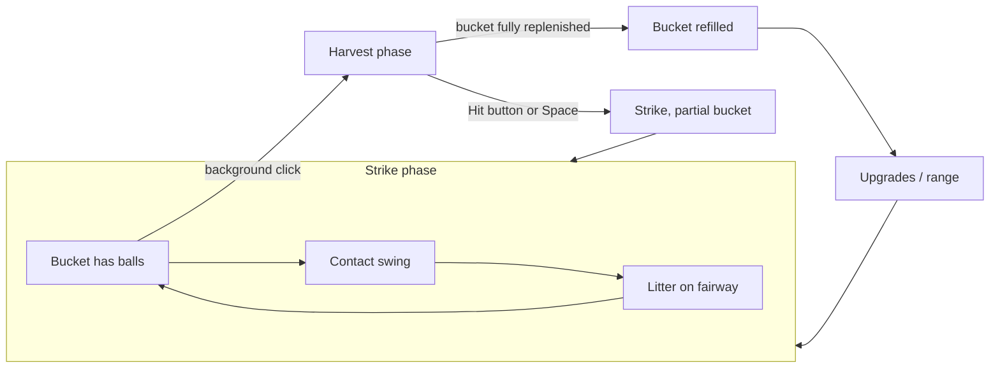

# v2 Core Loop

## Overview

Every session alternates **strike** and **harvest** phases inside a longer **build** loop.

## Phases

### 1. Strike phase (bucket has balls)

| Rule | Value |
|------|-------|
| Bucket size (early) | **6** balls (tune in `balance.gd`) |
| Input | **Space** — contact timing (see below) |
| Per-swing cooldown | Short (~1s) **inside** bucket — keeps burst snappy |
| Ball consumed | 1 per resolved swing |
| Litter | Each landing adds sprite to fairway cluster |

Switching to harvest is **voluntary**, not forced by an empty bucket. A left-click anywhere on the gameplay background (not on a UI button) enters harvest at any time, with any ball count — including 0. Any balls still unhit are stashed and merge back into the bucket when the player returns to strike.

### 2. Harvest phase (pickup mini-game)

See [06-pickup-minigame.md](06-pickup-minigame.md).

Summary: click litter on fairway → tween into bucket UI → combo bonus. The player can hit the **Hit button** (or press **Space**) at any time to return to strike with whatever they've collected so far — stashed + collected balls merge back into the bucket. The only *forced* return happens when the bucket is fully replenished (stash + collected balls reach capacity), which also clears any remaining litter and refills to full capacity.

**v2.0 MVP:** click pickup only. No gophers, no gnome. No swinging while in harvest — collect mode is pickup-only.

### 3. Spend phase (implicit)

After harvest payout, player opens upgrade tree or buys range tile upgrades (when implemented). No hard gate — natural pause between buckets.

## Swing: contact timing (replaces hold-to-charge)

| v1 | v2 |
|----|-----|
| Hold Space ~0.5s, release at peak | Press/hold through wind-up; **release at contact window** aligned to rat swing frame 9 |
| Power bar + shrinking rings primary | Contact flash / small sweet band; rings optional or simplified |
| `charge_progress` → wind-up frames 0–7 | Same anim mapping; quality from **release vs contact**, not hold duration |
| Overshoot decay → OK/Miss tiers | Single **timing axis** (early / pure / late) → tier + flavor |

**Contact timing is the v2 swing system.** There is no second skill check (no separate thin/fat grid, no chunk subsystem). One release-vs-contact axis drives tier, payout, and visual flavor.

### Contact timing axis

Player aim: release during the **pure** band at frame 9.

| Timing | Player read | Resolves to |
|--------|-------------|-------------|
| **Early** | Released before contact | Miss → **thin** flavor |
| **Pure** | Release in sweet band | Perfect / Good |
| **Late** | Released after contact | Miss → **chunk** flavor; OK tier can read **slightly fat** |

Early and late are the same axis as pure — not a parallel mechanic.

### Timing tiers and contact flavor

Tier labels are **Perfect / Great / Good / Okay / Bad / Miss** for HUD and payout — a six-rung ladder so distance and payout visibly separate between a weak real hit and a clean one. **Perfect is intentionally rare** (tight ms window by default); the Rhythm branch's Metronome upgrade widens it over time. **Flavor** names describe what the player *sees* on the fairway.

| Tier | Timing | Contact flavor | Feel | Payout mult |
|------|--------|----------------|------|-------------|
| Perfect | Pure (very tight window, rare) | **Pure** | Clean strike, satisfying arc | 1.0× |
| Great | Pure (wider window) | **Pure** | Crisp contact, high arc | ~0.8× |
| Good | Pure (wider still) | **Pure** | Solid contact, normal arc | ~0.6× |
| Okay | Pure edge or slightly late, still contacted | **Slightly fat** | Chunky but forward | ~0.4× |
| Bad | Weak real contact, near the edge of the timing window | **Slightly fat** | Barely got there, short and low | ~0.2× |
| Miss (early) | Too early | **Thin** | Skid, low dribble near tee | ~0.1× pity |
| Miss (late) | Too late | **Chunk** | Fat hop off turf, comedic short hop | ~0.1× pity |

**Fortune Mill chill rule retained:** Miss never zero.

**Do not implement:** a full early/late × thin/fat grid, or chunk/fat as a separate subsystem. Flavor follows tier + timing side (early vs late miss only).

### Depth rule (carry is always real)

Visual flight distance is **always exactly the gameplay yards** for every tier — no artificial floor or cap. A weak Bad/Okay hit visibly travels less than a Great or Perfect hit, and a whiff dribbles near the tee. This makes the ball's flight an honest readout of contact quality instead of a fixed "look" that's the same across most tiers.

**Perfect does not go stupid deep early.** Long carry unlocks through distance/power upgrades (`base_yards`, `max_yards`), not from Perfect timing alone at game start.

### Sweet spot upgrades (progression)

Upgrades widen the **pure** contact band (Perfect/Good windows) and unlock higher **carry tiers** on pure contact — not raw `base_yards` inflation early. See [04-upgrade-tree.md](04-upgrade-tree.md).

## Session rhythm (target feel)

| Time | Player state |
|------|----------------|
| 0–2 min | Learn contact; 6-ball buckets; pickup clicky |
| 2–8 min | First upgrades: bucket +1, sweet spot, pickup bonus |
| 8–20 min | Range visual tier 1 (patch crack); income mix shifts |
| 20+ min | Gnome/gopher (v2.1+), targets (v2.2+), ridiculous carry (late sweet spot) |

Early income is **intentionally slow per hit**; pickup bonus and bucket complete matter.

## First-session thoughts

New characters get a short **rat dialogue** overlay (Pokémon-style typewriter box):

1. **Welcome** — `Hey. Welcome to Range Rat.` then continue (Space / tap)
2. **Hold** — `Press and hold Space to take a cut.` (desktop) / `Press and hold to take a cut.` (mobile); waits for the first swing
3. **First-shot reaction** (once only) — Perfect/Great: praise; Bad/Miss: tempo tip (top of backswing, then release); Good/Okay: soft mid line. No further praise while finishing the bucket.
4. **First bucket** — `Okay. Let's knock out our first bucket.` Finish the bucket without extra interjects.
5. **Empty bucket** — after the last ball lands and settles, `We're out. Let's go collect the balls we have. Only a few, but I'm sure we can buy more later.` then **harvest enter** (desktop: click down-range; mobile: tap the bag / ball-picker icon — dialogue shows a shag-bag miniature on mobile)
6. **Harvest** — pick-up tip stays open and does **not** dismiss on click/Space (clicks pass through so balls can be collected). Space/Enter (or tap on the dialogue) while waiting plays a soft UI error and swaps in a find hint (desktop: drag/zoom + click with the ring; mobile: drag/pinch + tap with the ring); first successful `ball_collected` still auto-advances → done tip → return leftover balls via bottom-right bucket (dialogue shows a miniature of the bucket counter; no pay for returned lost balls)
7. **Upgrades (range)** — after harvest returns to strike, three Space-advancing panes: stuck-forever comedy → spend ball cash on upgrades → **Top-right. Click here.** (pulse + in-box miniature on the last pane only). Tip does **not** complete the tutorial yet.
8. **Upgrades (menu)** — first time the upgrades panel opens: broke anxiety → click this square. Dialogue stays above the panel (`TutorialOverlay` under `UIRoot`). Persisted via `tutorial_upgrade_menu_seen` so it does not repeat.
9. **Keep going** — after the first Play-tree `upgrade_purchased` and the upgrades panel closes (back on the range): `Keep going. Back to the bucket. Let's make more cash.` Then `tutorial_completed = true`.

Space/tap while typing finishes the line silently; Space/tap again slides the box out, then advances (except **HARVEST_PICK**, which waits for pickup). Portrait idle ping-pongs while the box is open. Progress is persisted (`tutorial_completed` / `tutorial_progress` / `tutorial_version`). Prestige does not replay it; character wipe does. Returning players (`tutorial_completed`) get a one-shot random “welcome back” line in the same dialogue box on Play — not the full tutorial.

## Camera

Fixed **down-the-line** — golfer lower-left, ball toward horizon. Litter clusters **up-screen** along stripe centerline. Pickup clicks target overlapping sprites (generous hit areas). See [02-ball-flight-and-camera.md](02-ball-flight-and-camera.md).

## Events (Godot)

Extend `EventBus` when implementing:

| Signal | When |
|--------|------|
| `bucket_changed(count, capacity)` | Ball added/removed from bucket |
| `phase_changed(strike \| harvest)` | Mode switch |
| `ball_collected(world_pos, combo)` | Pickup mini-game |
| `bucket_completed(bonus)` | Harvest done |
| `swing_resolved` | Keep; add contact tier + visual yards |

## v1 checklist superseded

- ~~Hold begins charge and power curve~~ → contact release at frame 9
- ~~Infinite tee reload~~ → bucket + pickup refill
- ~~Bucket empty triggers harvest~~ → harvest is voluntary (background click); empty bucket alone no longer forces a mode switch
- ~~Visual carry floor on OK+ contacts~~ → removed; flight is always proportional to actual yards

## Related docs

- Pickup: [06-pickup-minigame.md](06-pickup-minigame.md)
- Flight: [02-ball-flight-and-camera.md](02-ball-flight-and-camera.md)
- Economy: [03-economy.md](03-economy.md)
