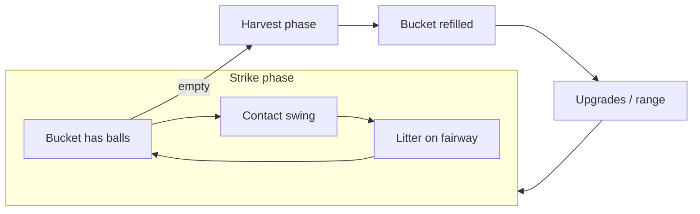

# v2 Core Loop

## Overview

Every session alternates **strike** and **harvest** phases inside a longer **build** loop.

## Phases

### 1. Strike phase (bucket has balls)

| Rule | Value |
|------|-------|
| Bucket size (early) | **6** balls (tune in `balance.gd`) |
| Input | **Space** — contact timing (see below) |
| Per-swing cooldown | Short (~1s) **inside** bucket — keeps burst snappy |
| Ball consumed | 1 per resolved swing |
| Litter | Each landing adds sprite to fairway cluster |

When bucket hits **0**, strike input disabled → harvest phase.

### 2. Harvest phase (pickup mini-game)

See [06-pickup-minigame.md](06-pickup-minigame.md).

Summary: click litter on fairway → tween into bucket UI → combo bonus → bucket full → return to strike.

**v2.0 MVP:** click pickup only. No gophers, no gnome.

### 3. Spend phase (implicit)

After harvest payout, player opens upgrade tree or buys range tile upgrades (when implemented). No hard gate — natural pause between buckets.

## Swing: contact timing (replaces hold-to-charge)

| v1 | v2 |
|----|-----|
| Hold Space ~0.5s, release at peak | Press/hold through wind-up; **release at contact window** aligned to rat swing frame 9 |
| Power bar + shrinking rings primary | Contact flash / small sweet band; rings optional or simplified |
| `charge_progress` → wind-up frames 0–7 | Same anim mapping; quality from **release vs contact**, not hold duration |
| Overshoot decay → OK/Miss tiers | Single **timing axis** (early / pure / late) → tier + flavor |

**Contact timing is the v2 swing system.** There is no second skill check (no separate thin/fat grid, no chunk subsystem). One release-vs-contact axis drives tier, payout, and visual flavor.

### Contact timing axis

Player aim: release during the **pure** band at frame 9.

| Timing | Player read | Resolves to |
|--------|-------------|-------------|
| **Early** | Released before contact | Miss → **thin** flavor |
| **Pure** | Release in sweet band | Perfect / Good |
| **Late** | Released after contact | Miss → **chunk** flavor; OK tier can read **slightly fat** |

Early and late are the same axis as pure — not a parallel mechanic.

### Timing tiers and contact flavor

Tier labels stay **Perfect / Good / OK / Miss** for HUD and payout. **Flavor** names describe what the player *sees* on the fairway.

| Tier | Timing | Contact flavor | Feel | Payout mult |
|------|--------|----------------|------|-------------|
| Perfect | Pure (tight window) | **Pure** | Clean strike, satisfying arc | 1.0× |
| Good | Pure (wider window) | **Pure** | Solid contact, slightly softer arc | ~0.7× |
| OK | Pure edge or slightly late, still contacted | **Slightly fat** | Chunky but forward; hits visual carry floor | ~0.4× |
| Miss (early) | Too early | **Thin** | Skid, low dribble near tee | ~0.1× pity |
| Miss (late) | Too late | **Chunk** | Fat hop off turf, comedic short hop | ~0.1× pity |

**Fortune Mill chill rule retained:** Miss never zero.

**Do not implement:** a full early/late × thin/fat grid, or chunk/fat as a separate subsystem. Flavor follows tier + timing side (early vs late miss only).

### Depth rule (carry vs visual)

Gameplay yards and screen depth follow different rules by tier:

| Tier / flavor | Visual depth (early game) | Extra depth |
|---------------|----------------------------|-------------|
| OK+ (incl. slightly fat) | **Visual carry floor** — at least first depth band (~50yd marker). See Phase B in [07-implementation-phases.md](07-implementation-phases.md). | No |
| Pure (Perfect / Good) | Same floor early; arc reads cleaner / slightly higher | Only via **carry tier** upgrades on pure contact (late game) |
| Thin / chunk (Miss) | Near tee — skid or hop; capped low `p` | No |

**Perfect does not go stupid deep early.** Absurd horizon carry unlocks only with sweet-spot **carry tier** upgrades on pure contact, not from Perfect alone at game start.

### Sweet spot upgrades (progression)

Upgrades widen the **pure** contact band (Perfect/Good windows) and unlock higher **carry tiers** on pure contact — not raw `base_yards` inflation early. See [04-upgrade-tree.md](04-upgrade-tree.md).

## Session rhythm (target feel)

| Time | Player state |
|------|----------------|
| 0–2 min | Learn contact; 6-ball buckets; pickup clicky |
| 2–8 min | First upgrades: bucket +1, sweet spot, pickup bonus |
| 8–20 min | Range visual tier 1 (patch crack); income mix shifts |
| 20+ min | Gnome/gopher (v2.1+), targets (v2.2+), ridiculous carry (late sweet spot) |

Early income is **intentionally slow per hit**; pickup bonus and bucket complete matter.

## Camera

Fixed **down-the-line** — golfer lower-left, ball toward horizon. Litter clusters **up-screen** along stripe centerline. Pickup clicks target overlapping sprites (generous hit areas). See [02-ball-flight-and-camera.md](02-ball-flight-and-camera.md).

## Events (Godot)

Extend `EventBus` when implementing:

| Signal | When |
|--------|------|
| `bucket_changed(count, capacity)` | Ball added/removed from bucket |
| `phase_changed(strike \| harvest)` | Mode switch |
| `ball_collected(world_pos, combo)` | Pickup mini-game |
| `bucket_completed(bonus)` | Harvest done |
| `swing_resolved` | Keep; add contact tier + visual yards |

## v1 checklist superseded

- ~~Hold begins charge and power curve~~ → contact release at frame 9
- ~~Infinite tee reload~~ → bucket + pickup refill
- Add: bucket empty triggers harvest
- Add: visual carry floor on OK+ contacts

## Related docs

- Pickup: [06-pickup-minigame.md](06-pickup-minigame.md)
- Flight: [02-ball-flight-and-camera.md](02-ball-flight-and-camera.md)
- Economy: [03-economy.md](03-economy.md)
