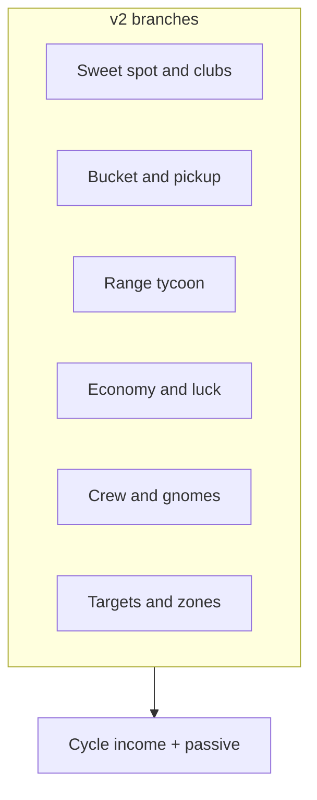

# v2 Upgrade Tree

## Design goal

Player always sees **3–5 affordable next purchases** across **different branches**. v2 branches reflect **superintendent + contact mastery**, not only `% yards`.

## Branch map vs v1

| v1 branch | v2 fate |
|-----------|---------|
| Rhythm (hold windows) | **Merged → Sweet spot** (contact windows) |
| Distance (base yards) | **Reduced early**; late carry tiers in Sweet spot |
| Economy | **Kept** |
| Clubs | **Sweet spot / named clubs** |
| Balls | **Bucket + ball quality** (pickup branch) |
| Range | **Expanded → Range tycoon** |
| Outfits | Deferred (cosmetic pass) |
| Friends | **Crew** (gnome, rat friends) |

---

## Branch A: Sweet spot and clubs

**Fantasy:** Clubs and form widen the **pure** contact band and unlock higher **carry tiers** on pure (Perfect / Good) hits — not early base power. Contact timing is a single axis (early / pure / late); sweet spot upgrades expand the pure window, not a separate thin/fat system. See [01-core-loop.md](01-core-loop.md#contact-timing-axis).

| Upgrade ID (example) | Effect |
|----------------------|--------|
| `contact_training` | +Perfect **pure** window ms per level |
| `groove_clubs` | +Good **pure** window ms per level |
| `face_angle` | Shifts quality curve toward higher carry tier on pure contact |
| `carry_tier_2` | Named unlock: **pure** hits can reach visual band 2 |
| `carry_tier_3` | Late: absurd horizon carry on **pure** contact only |
| `driver_rental` | Named club; small `clubMult` step |

**Not early:** `base_yards` ×1.13 per level spam. **Not in scope:** widening OK "slightly fat" into a second skill axis, or chunk/fat as its own upgrade branch.

**Depth coupling:** carry tier upgrades affect **pure** contact only. OK+ keeps the visual floor without extra depth; Perfect alone does not spike depth until carry tiers unlock.

---

## Branch B: Bucket and pickup

| Upgrade ID | Effect |
|------------|--------|
| `bucket_size_1` | +2 capacity (6→8) |
| `pickup_bonus` | +% $ per collected ball |
| `combo_window` | Longer combo decay time |
| `magnetic_glove` | Collect nearest 2 on click (late) |
| `ball_quality` | Better balls; +hit $ slightly |

---

## Branch C: Range tycoon (v2.1+)

Visible diorama upgrades on same scene.

| Upgrade ID | Effect |
|------------|--------|
| `patch_crack` | Visual: fill largest dirt crack; +passive $/sec |
| `grass_tier_1` | Stripe quality; +passive |
| `second_bay` | Prop + second mat silhouette; +passive |
| `range_lights` | Night palette unlock; +visitor mult |
| `snack_shack` | Flavor + small flat bonus per bucket |
| `scarecrow` | Gopher timer ×2 (v2.1) |

Each purchase should **change art** on `RangeView`, not only stats.

---

## Branch D: Economy and luck

| Upgrade ID | Effect |
|------------|--------|
| `dollars_per_yard` | $/yard per level |
| `global_mult` | Global payout mult |
| `tip_jar` | Flat $ per bucket complete |
| `perfect_bonus` | +% on Perfect tier |

---

## Branch E: Crew (v2.1–v2.2)

| Upgrade ID | Effect |
|------------|--------|
| `hire_gnome` | Auto-collects 1 aging ball / bucket cycle |
| `gnome_speed` | Gnome picks faster during harvest |
| `rat_friend_bay_2` | NPC rat in bay 2; slow auto-swings (passive $) |
| `friend_clubs` | Friend yard mult |

Replaces v1 "golf friend lawn chair" fantasy with range-native crew.

---

## Branch F: Targets and zones (v2.2+)

Gated by lifetime `$` or milestone (e.g. $100k).

| Upgrade ID | Effect |
|------------|--------|
| `target_band_100` | Unlock 100yd depth ring scoring |
| `bullseye_net` | Center jackpot zone |
| `zone_2_pass` | Unlock target bay scene/chapter |

Uses `target_zone_mult` in payout formula.

---

## v2.0 shipped content (first implementation slice)

Only these need full definitions in `definitions.gd`:

1. **Sweet spot** — 3–4 levels contact window
2. **Bucket / pickup** — bucket size, pickup bonus
3. **Economy** — $/yard, tip jar

Range tycoon, crew, targets: **stub** nodes locked in UI.

---

## Related docs

- Core loop: [01-core-loop.md](01-core-loop.md)
- Phases: [07-implementation-phases.md](07-implementation-phases.md)
- v1 full tree reference: [../design/04-upgrade-tree.md](../design/04-upgrade-tree.md)
