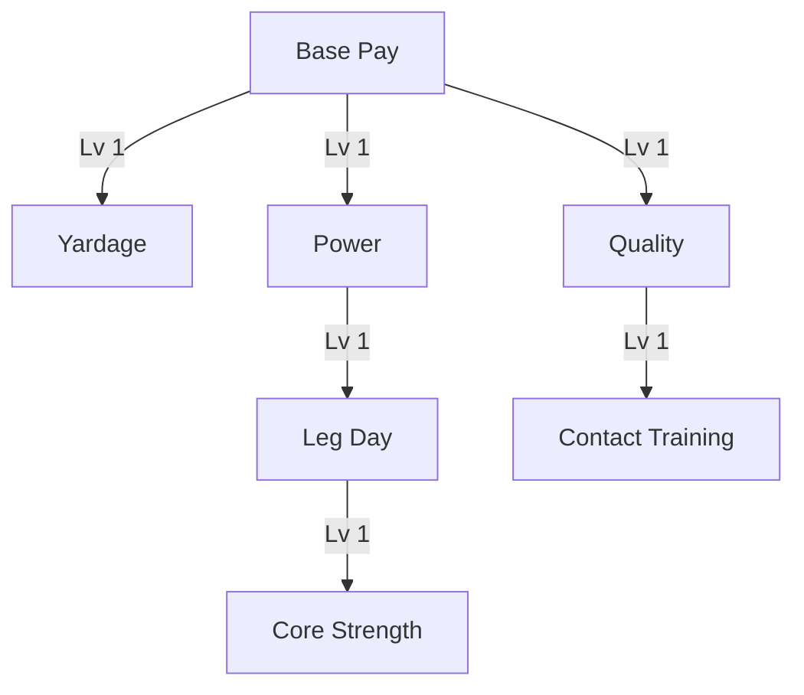

# v2 Upgrade Tree

## Design goal

Slow-start formula progression. Only **mechanical/formula** upgrades live in the tree. Equipment (balls, bucket capacity, clubs, clothing), crew (Ratina), and range tycoon items are deferred to a separate **Shop**.

Barebones **colored polygon nodes** (square/circle/triangle/diamond per branch) — no sprite icons.

## Fan-out structure

As soon as **Base Pay** reaches level 1, three branch heads reveal simultaneously:

## Nodes (7 total)

| Node | Branch | Shape | Effect |
|------|--------|-------|--------|
| `base_pay` | Base Pay | square | +`base_amount` |
| `yardage` | Yardage | circle | unlock yardage term + `yardage_multiplier` |
| `quality` | Quality | triangle | unlock quality term + `quality_multiplier` |
| `power` | Power | diamond | +`yard_multiplier` |
| `leg_day` | Power | diamond | +`base_yards` |
| `core_strength` | Power | diamond | +`max_yards` |
| `contact_training` | Quality | triangle | widen Perfect window |

Each branch **head** (`yardage`, `quality`) is both the formula-unlock key and the first level of that branch's stat growth.

## Tree access

Icon-bar Upgrade Tree button: one-time **$1.50** unlock (see [03-economy.md](03-economy.md)).

## Cut / deferred

| Item | Fate |
|------|------|
| Bucket size | **Shop** (removed from tree) |
| Old 11-node v1 tree | **Removed** |
| Clubs, Balls, Outfits | **Shop** |
| Range tycoon, Crew/Ratina | **Shop** |
| Crit / target zones | **Cut / deferred** |

## Related docs

- Economy formula: [03-economy.md](03-economy.md)
