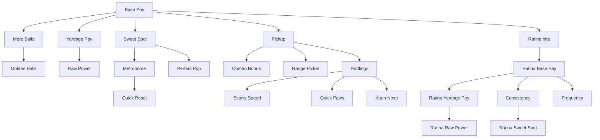

# v2 Upgrade Tree

## Design goal

**Distance-pays:** contact decides flight; yards decide cash. Warm exponential start on money; **Power branch** is Yardage Pay ($/yard) then Raw Power (+3 yd). Quality is **Sweet Spot** (flight contact) + Perfect Pop, not a cash multiplier. See [03-economy.md](03-economy.md).

All progression lives in one **pannable, zoomable radial mega-tree** — player upgrades, shop items (ball count, golden balls), Ratina hire + subtree, and Rattlings hire + subtree. No separate shop panel or tabs.

Barebones **colored polygon nodes** per branch.

## Fan-out structure

At **Base Pay Lv.1**, four branch heads reveal: **Yardage Pay**, **Sweet Spot** (`quality`), **Pickup**, and **More Balls** (`ball_count`).

## Nodes (23 total in mega-tree)

**Player (11):** `base_pay`, `distance_pay`, `iron_set`, `quality`, `metronome`, `perfect_pop`, `quick_reset`, `pickup`, `combo_bonus`, `range_picker`, `ratina_hire`

**Shop (2):** `ball_count`, `golden_ball`

**Ratina (6):** `ratina_base_pay`, `ratina_distance_pay`, `ratina_consistency`, `ratina_frequency`, `ratina_raw_power`, `ratina_quality`

**Rattlings (4):** `rattling_more` through `rattling_keen_nose`

| Node | Branch | Effect | Player fantasy |
|------|--------|--------|------------------|
| `base_pay` | Base Pay | × `base_amount` | Flat $ per ball |
| `distance_pay` | Power | unlock + × `pay_per_yard` | **$/yard flown** |
| `iron_set` | Power | **+3 `base_yards` / level** | Raw Power — baseline distance |
| `quality` | Quality | unlock + `sweet_spot_bonus` | Sweet Spot — cleaner contact flies farther |
| `metronome` | Quality | widen Perfect + Great windows | Timing QoL |
| `perfect_pop` | Quality | × `perfect_power_bonus` | Late Perfect power fantasy |
| `quick_reset` | Quality | ×0.5 swing cooldown | Faster buckets |
| `pickup` | Pickup | unlock + × `pickup_multiplier` | Harvest bonuses |
| `combo_bonus` | Pickup | +`combo_mult_per_tier` | Fast harvest mult |
| `range_picker` | Pickup | +`range_picker_radius_bonus` | Larger harvest circle |
| `ball_count` | Pickup | +bucket capacity | More balls per bucket |
| `golden_ball` | Quality | golden chance | Double-pay balls |
| `ratina_hire` | Base Pay | unlock Ratina | Hire autonomous hitter ($100, Base Pay Lv.3) |
| `rattling_more` | Pickup | hire + count | Hire collectors ($10 Lv.1 = one Rattling, Pickup Lv.2) |

### Ratina subtree

Starts ~50% of player money/power defaults. Same distance-pays model; Consistency replaces timing skill; one Frequency spine (no Rapid Fire / Gatling).

| Node | Effect |
|------|--------|
| `ratina_base_pay` | × `base_amount` |
| `ratina_distance_pay` | unlock + × `pay_per_yard` |
| `ratina_raw_power` | +3 `base_yards` |
| `ratina_consistency` | +`consistency` (RNG toward better tiers) |
| `ratina_quality` | Sweet Spot (flight) |
| `ratina_frequency` | ×0.90 `swing_cooldown_ms` / level (deep spine) |

Layout is auto-generated from graph topology (`UpgradeGraph` + `RadialTreeLayout`): elliptical wedge skeleton + organic force relaxation that settles into a landscape **16:9** band. Positions are static; nodes reveal when their parent is purchased.

## Tree access

Icon-bar Upgrade Tree: one-time **$1.50** unlock (see [03-economy.md](03-economy.md)).

## Related docs

- Economy formula: [03-economy.md](03-economy.md)
- Pickup / vanish horizon: [06-pickup-minigame.md](06-pickup-minigame.md)
