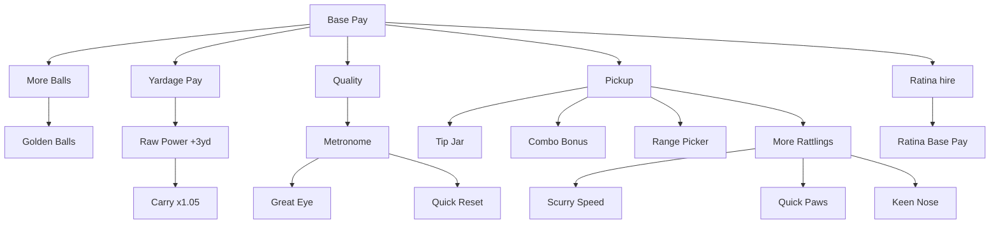

# v2 Upgrade Tree

## Design goal

**Warm exponential start** on money; **clear Power branch** — Yardage Pay ($/yard) first, then Raw Power (+3 yd), then Carry (×1.05). See [03-economy.md](03-economy.md).

All progression lives in one **pannable, zoomable radial mega-tree** — player upgrades, shop items (ball count, golden balls), Ratina hire + subtree, and Rattlings hire + subtree. No separate shop panel or tabs.

Barebones **colored polygon nodes** per branch.

## Fan-out structure

At **Base Pay Lv.1**, four branch heads reveal: **Yardage Pay**, **Quality**, **Pickup**, and **More Balls** (`ball_count`).

## Nodes (29 total in mega-tree)

**Player (13):** `base_pay`, `distance_pay`, `iron_set`, `power`, `quality`, `metronome`, `great_eye`, `quick_reset`, `pickup`, `tip_jar`, `combo_bonus`, `range_picker`, `ratina_hire`

**Shop (2):** `ball_count`, `golden_ball`

**Ratina (10):** `ratina_base_pay` through `ratina_gatling_barrel`

**Rattlings (4):** `rattling_more` through `rattling_keen_nose`

| Node | Branch | Effect | Player fantasy |
|------|--------|--------|------------------|
| `base_pay` | Base Pay | × `base_amount` | Flat $ per ball |
| `distance_pay` | Power | unlock + × `pay_per_yard` | **$/yard flown** (not flight) |
| `iron_set` | Power | **+3 `base_yards` / level** | Raw Power — baseline distance |
| `power` | Power | ×1.05 `carry_multiplier` / level | Carry — multiplicative capstone |
| `quality` | Quality | unlock tier pay + × `quality_multiplier` | Clean contact pays |
| `metronome` | Quality | widen Perfect window | Timing QoL |
| `great_eye` | Quality | widen Great window | Timing QoL |
| `quick_reset` | Quality | ×0.5 swing cooldown | Faster buckets |
| `pickup` | Pickup | unlock + × `pickup_multiplier` | Harvest bonuses |
| `tip_jar` | Pickup | +`pickup_flat_bonus` | Flat pickup $ |
| `combo_bonus` | Pickup | +`combo_mult_per_tier` | Fast harvest mult |
| `range_picker` | Pickup | +`range_picker_radius_bonus` | Larger harvest circle |
| `ball_count` | Pickup | +bucket capacity | More balls per bucket |
| `golden_ball` | Quality | golden chance | Double-pay balls |
| `ratina_hire` | Base Pay | unlock Ratina | Hire autonomous hitter ($100, Base Pay Lv.3) |
| `rattling_more` | Base Pay | +rattling count | Hire collectors ($10 Lv.1, Pickup Lv.2) |

Layout is auto-generated from graph topology (`UpgradeGraph` + `RadialTreeLayout`): elliptical wedge skeleton + organic force relaxation that settles into a landscape **16:9** band. Positions are static; nodes reveal when their parent is purchased.

## Tree access

Icon-bar Upgrade Tree: one-time **$1.50** unlock (see [03-economy.md](03-economy.md)).

## Related docs

- Economy formula: [03-economy.md](03-economy.md)
- Pickup / vanish horizon: [06-pickup-minigame.md](06-pickup-minigame.md)
