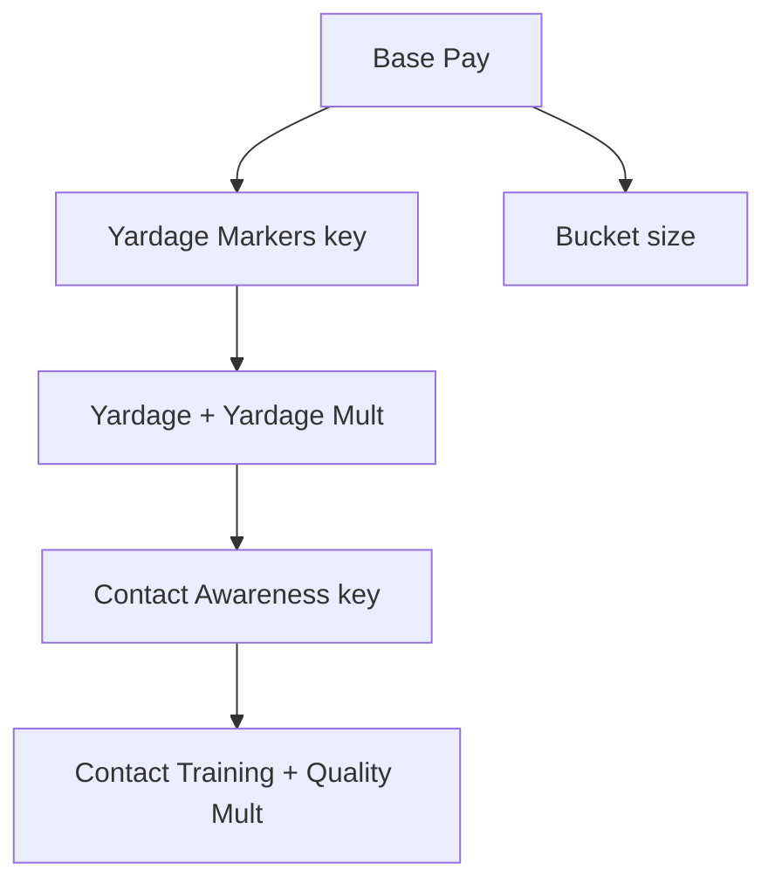

# v2 Upgrade Tree

## Design goal

Slow-start formula progression. Only **mechanical/formula** upgrades live in the tree. Equipment (balls, clubs, clothing), crew (Ratina), and range tycoon items are deferred to a separate **Shop** (gated later by a tree milestone).

Player always sees **affordable next purchases** across visible branches. UI is placeholder/barebones for now — functional nodes only.

## Formula unlock spine

## Branches (v3 overhaul)

| Branch | Upgrades | Effect |
|--------|----------|--------|
| **Base Pay** | `base_pay` | +`base_amount` per level (starts $0.25) |
| **Bucket** | `bucket_size` | +bucket capacity |
| **Yardage** (key) | `yardage_markers` | Binary unlock: yardage term in payout formula |
| **Yardage** | `yardage`, `yardage_cap` | +`base_yards`, +`max_yards` (flight + stored litter yardage) |
| **Yardage Mult** | `yardage_mult` | +`yardage_multiplier` (rate constant, starts 0.02) |
| **Contact** (key) | `contact_awareness` | Binary unlock: quality term in payout formula |
| **Contact** | `contact_training` | Widen Perfect timing window |
| **Quality Mult** | `quality_mult` | +`quality_multiplier` (1.0-start bonus mult) |

## Cut / deferred

| Old v1/v2 branch | Fate |
|------------------|------|
| Power / Distance / Rhythm / Economy (old tree) | **Removed** — replaced by formula spine above |
| Clubs, Balls, Outfits | **Shop** (later) |
| Range tycoon | **Shop** (later) |
| Crew / Ratina | **Shop** (later) |
| Crit / jackpot branch | **Cut** |
| Target zones | **Deferred** |

## v2.0 shipped content (current slice)

Full definitions in `scripts/game/upgrades/definitions.gd`:

1. Base Pay + Bucket
2. Yardage Markers key + Yardage + Yardage Mult
3. Contact Awareness key + Contact Training + Quality Mult

Shop stubs: not implemented.

## Related docs

- Economy formula: [03-economy.md](03-economy.md)
- Phases: [07-implementation-phases.md](07-implementation-phases.md)
