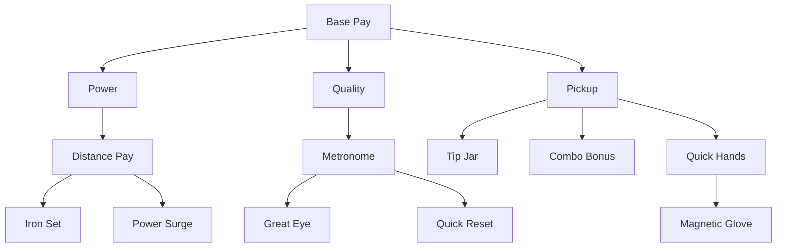

# v2 Upgrade Tree

## Design goal

**Hot exponential start** — Base Pay doubles income each level; branch stats double per level too. Costs double in parallel so progress feels nuclear but purchases still require saving.

Mechanical/formula upgrades in the tree; equipment and shop deferred.

Barebones **colored polygon nodes** per branch.

## Fan-out structure

At **Base Pay Lv.1**, three branch heads reveal: **Power**, **Quality**, **Pickup**.

## Nodes (14 total)

| Node | Branch | Effect |
|------|--------|--------|
| `base_pay` | Base Pay | **×2 `base_amount` per level** ($0.25 → $0.50 → $1.00 …) |
| `power` | Power | **×2 `carry_multiplier`** (flight) |
| `distance_pay` | Power | unlock yardage pay + **×2 `pay_per_yard`** |
| `iron_set` | Power | **×2 `base_yards`** |
| `power_surge` | Power | **×2 `carry_multiplier`** |
| `quality` | Quality | unlock tier pay + **×2 `quality_multiplier`** |
| `metronome` | Quality | widen Perfect window (+8 ms/level) |
| `great_eye` | Quality | widen Great window (+10 ms/level) |
| `quick_reset` | Quality | **×0.5 swing cooldown** (~2× swings/bucket) |
| `pickup` | Pickup | unlock pickup bonuses + **×2 `pickup_multiplier`** |
| `tip_jar` | Pickup | +$0.25 `pickup_flat_bonus`/level |
| `combo_bonus` | Pickup | +10% `combo_mult_per_tier`/level |
| `quick_hands` | Pickup | +0.15 s combo window/level |
| `magnetic_glove` | Pickup | stub |

All nodes use **×2 cost growth** (`growthRate = 2.0`). Base Pay: `baseCost $1.50`, max 25 levels. Branch heads: `baseCost $6.00`.

Tooltips show descriptive text plus quantitative **Now → Next** stat previews.

## Tree access

Icon-bar Upgrade Tree: one-time **$1.50** unlock (see [03-economy.md](03-economy.md)).

## Related docs

- Economy formula: [03-economy.md](03-economy.md)
