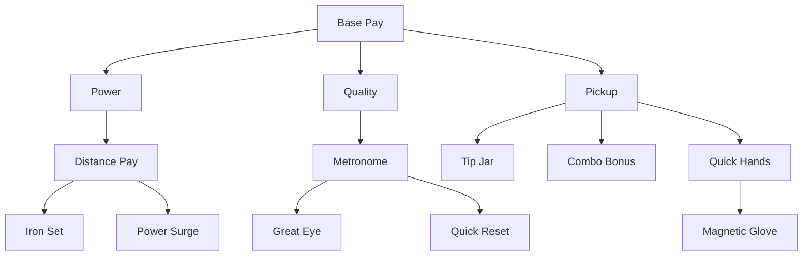

# v2 Upgrade Tree

## Design goal

**Warm exponential start** — income and costs grow exponentially, but **not ×2 paired doubling**. Money branches (~1.25–1.35× effect) outpace power (~1.12–1.15×) so distance feels earned while `$` still spikes on good harvests. See [03-economy.md](03-economy.md#growth-curves-per-branch).

Mechanical/formula upgrades in the tree; equipment and shop deferred.

Barebones **colored polygon nodes** per branch.

## Fan-out structure

At **Base Pay Lv.1**, three branch heads reveal: **Power**, **Quality**, **Pickup**.

## Nodes (14 total)

| Node | Branch | Effect | effectGrowth | cost growthRate | baseCost |
|------|--------|--------|--------------|-----------------|----------|
| `base_pay` | Base Pay | **× `base_amount`** ($0.25 → $0.34 → $0.46 …) | **1.35** | **1.42** | $1.50 |
| `power` | Power | **× `carry_multiplier`** (flight) | **1.15** | **1.18** | $6.00 |
| `distance_pay` | Power | unlock yardage pay + **× `pay_per_yard`** | **1.25** | **1.28** | $12.00 |
| `iron_set` | Power | **× `base_yards`** | **1.12** | **1.16** | $24.00 |
| `power_surge` | Power | **× `carry_multiplier`** (stacks) | **1.15** | **1.18** | $24.00 |
| `quality` | Quality | unlock tier pay + **× `quality_multiplier`** | **1.22** | **1.25** | $6.00 |
| `metronome` | Quality | widen Perfect window (+8 ms/level) | add | **1.22** | $12.00 |
| `great_eye` | Quality | widen Great window (+10 ms/level) | add | **1.24** | $24.00 |
| `quick_reset` | Quality | **×0.5 swing cooldown** (~2× swings/bucket) | **0.5** | **1.30** | $24.00 |
| `pickup` | Pickup | unlock pickup bonuses + **× `pickup_multiplier`** | **1.28** | **1.32** | $6.00 |
| `tip_jar` | Pickup | +$0.25 `pickup_flat_bonus`/level | add | **1.22** | $12.00 |
| `combo_bonus` | Pickup | +10% `combo_mult_per_tier`/level | add | **1.22** | $12.00 |
| `quick_hands` | Pickup | +0.15 s combo window/level | add | **1.22** | $12.00 |
| `magnetic_glove` | Pickup | stub | binary | **1.35** | $48.00 |

**Current code** still uses ×2 everywhere in `definitions.gd` — rebalance by applying this table. Max levels unchanged (`base_pay` 25; most branches 8–20).

### Branch roles (why different curves)

| Branch | Player fantasy | Growth speed | Rationale |
|--------|----------------|--------------|-----------|
| **Base Pay** | "My range pays better" | Fastest money | Dopamine spine; still not ×2 |
| **Pickup** | "Harvesting is satisfying" | Fast money + QoL | Combo/tip jar reward skill without nuking early |
| **Quality** | "Clean contact pays" | Medium | Tier mult + timing windows — skill expression |
| **Power** | "I hit it farther" | **Slowest** | Flight is visible progress; ×2 makes the fairway useless in minutes |

Tooltips show descriptive text plus quantitative **Now → Next** stat previews.

## Tree access

Icon-bar Upgrade Tree: one-time **$1.50** unlock (see [03-economy.md](03-economy.md)).

## Related docs

- Economy formula: [03-economy.md](03-economy.md)
