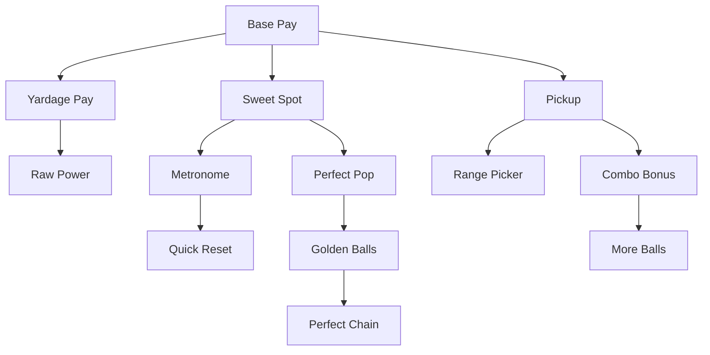

# v2 Upgrade Tree

## Design goal

**Distance-pays:** contact decides flight; yards decide cash. Warm exponential start on money; **Power branch** is Yardage Pay ($/yard) then Raw Power (+3 yd). Quality is **Sweet Spot** (flight contact) + Perfect Pop, not a cash multiplier. See [03-economy.md](03-economy.md).

All progression lives in one **pannable, zoomable radial cash tree**. Late OP nodes (More Balls, Golden Balls, Combo, Quick Reset, Perfect Chain) sit deep on existing branches — expensive and gated by high parent levels. **No prestige / cheese currency.** Ratina and Rattlings stay off the player-facing graph (dormant for a later rework).

Nodes use custom **32×32 pixel-art icons** (`assets/sprites/upgrades/<upgrade_id>.png`, nearest filter) in compact **44×44 pixel squircle medallions** — dark fill + branch-colored outline with **chunky stepped corners** (axis-aligned stairs, not smooth arcs) so the chrome matches the pixel-art icons. Icons use `STRETCH_KEEP_CENTERED`. Nodes are icon-only; level, cost, and effect preview appear in a **top-level hover tooltip** that does not resize the node. Edges and borders share stroke widths so they scale together under TreeWorld pan/zoom. Opening the panel zooms to the **full tree layout**, not only currently revealed nodes.

**Stroke colors** (borders use the node's palette; connector edges use the target child's palette):
- **Base Pay** — warm gold
- **Power** — true red (distinct from Ratina pink)
- **Quality** (tempo, sweet spot, metronome) — teal-blue
- **Pickup** — green

**Edge states:** dormant (target locked) → live solid branch color (unlocked) → charged brighter solid + soft glow with light pulse (purchasable) → complete solid + soft glow (maxed). **Borders:** solid for locked/unlocked; thicker solid + glow when maxed; solid + glow pulse when purchasable (no dashed orbit). Connectors attach to the squircle rim.

**Dynamics:** Hover scales the node and brightens its border; tooltips fade/slide in. Purchase plays a short squash-stretch burst, surges the inbound edge in branch color, and staggered-pops newly revealed children. Warm parallax sky + wood header stay; no CRT/grid restyle.

## Fan-out structure

At **Base Pay Lv.1**, three branch heads reveal: **Yardage Pay**, **Sweet Spot** (`quality`), and **Pickup**. Late OP nodes unlock deeper on Quality / Pickup.

```text
Base Pay
  ├── Yardage Pay → Raw Power
  ├── Sweet Spot
  │     ├── Metronome → Quick Reset          (Metronome Lv.10; very expensive)
  │     └── Perfect Pop → Golden Balls → Perfect Chain
  └── Pickup
        ├── Range Picker
        └── Combo Bonus → More Balls
```



## Nodes (13 on the cash tree)

**Core (8):** `base_pay`, `distance_pay`, `iron_set`, `quality`, `metronome`, `perfect_pop`, `pickup`, `range_picker`

**Late OP (5):** `quick_reset`, `combo_bonus`, `ball_count`, `golden_ball`, `perfect_chain`

| Node | Branch | Unlock | Effect | Player fantasy |
|------|--------|--------|--------|----------------|
| `base_pay` | Base Pay | — | × `base_amount` | Flat $ per ball |
| `distance_pay` | Power | Base Pay Lv.1 | unlock + × `pay_per_yard` | **$/yard flown** |
| `iron_set` | Power | Yardage Pay Lv.1 | **+3 `base_yards` / level** | Raw Power — baseline distance |
| `quality` | Quality | Base Pay Lv.1 | unlock + `sweet_spot_bonus` | Sweet Spot — cleaner contact flies farther |
| `metronome` | Quality | Sweet Spot Lv.1 | widen Perfect + Great windows | Timing QoL |
| `perfect_pop` | Quality | Sweet Spot Lv.3 | × `perfect_power_bonus` | Late Perfect power fantasy |
| `quick_reset` | Quality | Metronome **Lv.10** | ×0.85 swing cooldown / level | Late, **very expensive** tempo |
| `pickup` | Pickup | Base Pay Lv.1 | unlock + × `pickup_multiplier` | Harvest bonuses |
| `combo_bonus` | Pickup | Pickup **Lv.8** | +0.08 `combo_mult_per_tier` / level | Fast harvest mult |
| `range_picker` | Pickup | Pickup Lv.1 | +`range_picker_radius_bonus` | Larger harvest circle |
| `ball_count` | Pickup | Combo Bonus Lv.1 | +1 bucket capacity / level | More balls per bucket |
| `golden_ball` | Quality | Perfect Pop **Lv.5** | +2% golden chance / level | Double-pay balls |
| `perfect_chain` | Quality | Golden Balls **Lv.3** | After 3 Perfects, teed balls stay golden while streak holds | Capstone skill spike |

**Quick Reset cost intent:** first buy ~$200, growth ~1.70 — the priciest tempo node on the tree.

Crew (Ratina / Rattlings) remains **hidden** from the graph until a later rework.

Layout is auto-generated from graph topology (`UpgradeGraph` + `RadialTreeLayout`): elliptical wedge skeleton + organic force relaxation that settles into a landscape **16:9** band. Positions are static; nodes reveal when their parent is purchased.

## Tree access

Icon-bar Upgrade Tree is available from the start of a run (see [03-economy.md](03-economy.md)).

## Related docs

- Economy formula: [03-economy.md](03-economy.md)
- Pickup / vanish horizon: [06-pickup-minigame.md](06-pickup-minigame.md)
