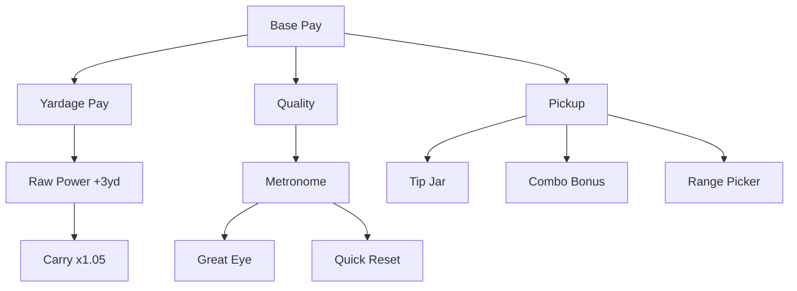

# v2 Upgrade Tree

## Design goal

**Warm exponential start** on money; **clear Power branch** — Yardage Pay ($/yard) first, then Raw Power (+3 yd), then Carry (×1.05). See [03-economy.md](03-economy.md).

Mechanical/formula upgrades in the tree; equipment and shop deferred.

Barebones **colored polygon nodes** per branch.

## Fan-out structure

At **Base Pay Lv.1**, three branch heads reveal: **Yardage Pay**, **Quality**, **Pickup**.

## Nodes (12 total)

| Node | Branch | Effect | Player fantasy |
|------|--------|--------|------------------|
| `base_pay` | Base Pay | × `base_amount` | Flat $ per ball |
| `distance_pay` | Power | unlock + × `pay_per_yard` | **$/yard flown** (not flight) |
| `iron_set` | Power | **+3 `base_yards` / level** | Raw Power — baseline distance |
| `power` | Power | ×1.05 `carry_multiplier` / level | Carry — multiplicative capstone |
| `quality` | Quality | unlock tier pay + × `quality_multiplier` | Clean contact pays |
| `metronome` | Quality | widen Perfect window | Timing QoL |
| `great_eye` | Quality | widen Great window | Timing QoL |
| `quick_reset` | Quality | ×0.5 swing cooldown | Faster buckets |
| `pickup` | Pickup | unlock + × `pickup_multiplier` | Harvest bonuses |
| `tip_jar` | Pickup | +`pickup_flat_bonus` | Flat pickup $ |
| `combo_bonus` | Pickup | +`combo_mult_per_tier` | Fast harvest mult |
| `range_picker` | Pickup | +`range_picker_radius_bonus` | Larger harvest circle |

Tooltips on flight nodes lead with **Perfect carry yards** (e.g. `Carry: 72 yd → 76 yd`).

## Tree access

Icon-bar Upgrade Tree: one-time **$1.50** unlock (see [03-economy.md](03-economy.md)).

## Related docs

- Economy formula: [03-economy.md](03-economy.md)
- Pickup / vanish horizon: [06-pickup-minigame.md](06-pickup-minigame.md)
